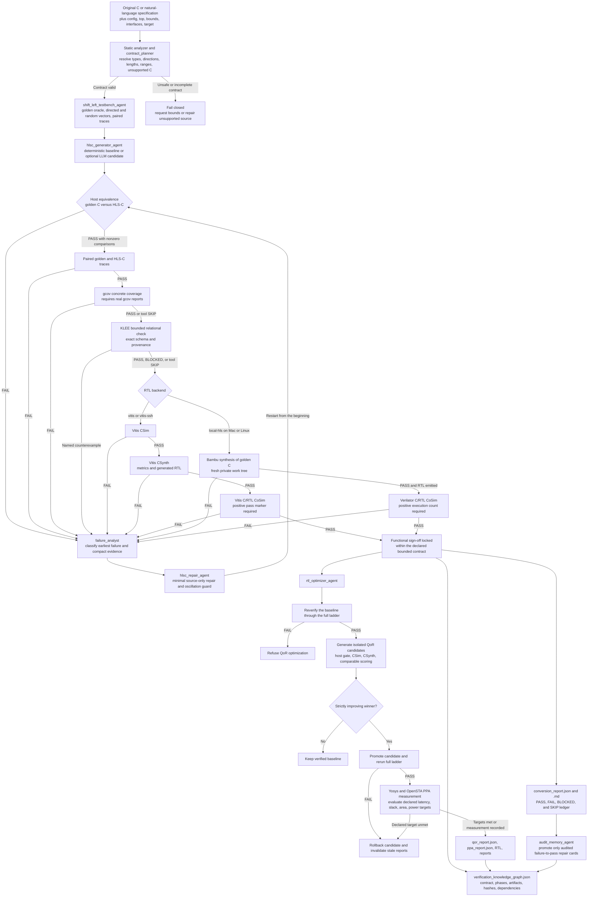

# C2HLSC Agent Workflow

This document maps the live C-to-HLS-C-to-RTL workflow, the responsibility of each
agent, and the evidence required before the system may claim a correct outcome.

## End-to-End Graph

The graph is intentionally fail-closed. A repair or QoR candidate never resumes from the
stage after its edit: it returns to host equivalence so an earlier semantic regression
cannot be hidden by a later synthesis or CoSim pass.

## Component Responsibilities and Vitalness

| Component | What it does | Vitalness | Failure behavior | Main evidence |
| --- | --- | --- | --- | --- |
| Static analyzer | Parses the top function, types, pointer use, unsupported constructs, and explicit config | Mandatory sign-off gate | Stops before generation unless `--keep-going`, which still cannot produce a passing verdict | Diagnostics in conversion report |
| `contract_planner` | Proposes missing directions, lengths, and ranges; user config wins per field | Mandatory contract, optional LLM refinement | Invalid proposals are rejected and deterministic analysis remains authoritative | `contract_plan.json`, contract nodes in knowledge graph |
| `shift_left_testbench_agent` | Builds the golden oracle, synchronized vectors, paired traces, gcov, and KLEE harness | Critical correctness layer | A trace or valid relational mismatch blocks HLS; unavailable optional tools are explicit `SKIP` | Testbenches, traces, coverage JSON, KLEE JSON |
| `hlsc_generator_agent` | Emits synthesizable HLS-C while preserving observable behavior and recording transformations | Critical candidate producer | Its output is never trusted without verification | `src/hls_top.cpp`, header, transformation ledger |
| Host equivalence | Compares original C and HLS-C using cloned inputs and observable post-state | Highest-priority mandatory gate | Any compile error, mismatch, timeout, or zero-comparison run fails | `software_equivalence.log` |
| Paired traces and gcov | Checks synchronized cycle records and records concrete source/branch execution | Mandatory trace gate; coverage evidence may skip only when tooling is unavailable | Mismatched traces or unusable coverage artifacts fail closed | Trace CSVs, `.gcov`, `gcov_report.json` |
| Relational KLEE | Searches the bounded contract for a named golden-C/HLS-C counterexample | Conditional formal gate | Exact counterexample fails; unsupported or missing tool is `BLOCKED` or `SKIP`, never a proof | `klee_report.json` with hashes and scope |
| `cosim_operator` | Runs the selected HLS ladder in short-circuit order | Mandatory when RTL is requested | Stops at the earliest failing phase and preserves logs | CSim, CSynth, CoSim logs and reports |
| Native Vitis/Vivado backend | Synthesizes HLS-C and checks generated RTL against it | Authoritative AMD RTL and QoR path | Requires fresh reports, all fresh RTL, and a newer positive CoSim log | `csynth.xml`, RTL, `vitis_evidence.json` |
| Bambu backend | Provides fast local golden-C-to-RTL correctness evidence | Strong local correctness gate, not Vitis QoR | Publishes RTL only after same-run Verilator CoSim passes | `rtl/*.v`, Bambu logs, execution count |
| `failure_analyst` | Assigns the earliest failure family and repair owner | Critical routing/control | Infrastructure failures remain blocked; semantic failures receive compact repair evidence | Agent decision in conversion report |
| `hlsc_repair_agent` | Applies minimal mechanical or optional LLM source repairs | Conditional recovery layer | Cannot edit the golden oracle; repeated source states are rejected | `repair_audit.json` |
| Verification knowledge graph | Indexes contracts, phases, artifacts, hashes, repair outcomes, and dependencies | Important audit/navigation layer, not a proof engine | Reflects phase status but cannot override a failed gate | `verification_knowledge_graph.json` |
| `rtl_optimizer_agent` | Searches latency/area/balanced candidates after correctness is locked | Post-sign-off only | Refuses an unverified baseline; every winner must pass the full ladder or roll back | `qor_report.json`, candidate history |
| Yosys/OpenSTA PPA | Measures area, timing slack, and power on a declared node/liberty | Mandatory only for declared PPA targets | Missing or unmet declared criteria fail; no-target PASS means measurement completed, not improvement | `ppa_report.json`, area and STA reports |
| `audit_memory_agent` | Stores reusable repair strategies only after an audited final pass | Optional learning layer | Failed or intermediate repairs are never promoted | Audit-memory JSONL cards |

## What Happens Between Steps

1. The contract becomes the shared interface between generation and every verifier. Bounds
   determine stimulus, pointer cloning, trace columns, symbolic state, and HLS interfaces.
2. The generator produces a candidate, but the original C remains isolated as the golden
   oracle. A model may propose code; it cannot authorize acceptance.
3. Verification short-circuits at the earliest failure. Later phases are marked `BLOCKED`
   so missing evidence cannot look like success.
4. The failure analyst reduces the failing phase into a family, symbols, log excerpt, and
   permitted repair scope. The repair agent changes only the candidate and restarts the
   ladder.
5. A CoSim pass is combined with the earlier golden-C/HLS-C comparison. CoSim alone proves
   only HLS-C-to-RTL behavior under its testbench, not original-C-to-RTL equivalence.
6. Every completed phase updates the report and knowledge graph with statuses and artifact
   references. The graph helps trace evidence; the phase gates remain authoritative.
7. QoR begins only after a new full-ladder baseline pass. Candidates are scored in isolated
   directories, and the selected winner is promoted only after another complete pass.
8. Audit memory sees only final audited repair successes, preventing failed attempts or
   golden-source content from contaminating later repair prompts.

## Backend and Online Workflow Map

| Execution path | Environment | Trigger | Current requirement | Claim it can support |
| --- | --- | --- | --- | --- |
| Unit CI | GitHub-hosted Ubuntu, Python 3.10-3.12 | Every push and pull request | No licensed tools | Software regression only |
| Native Vitis CI | Self-hosted Linux runner | Manual dispatch, or push when `C2HLSC_VITIS_CI=true` | Labels `self-hosted, linux, x64, vitis-hls`; licensed AMD launcher | Native Vitis CSim, CSynth, CoSim, RTL, and QoR evidence |
| Native AMD HLS Windows CI | Self-hosted Windows runner | Manual dispatch, or push when `C2HLSC_VIVADO_WINDOWS_CI=true` | Labels `self-hosted, windows, x64, vivado-hls`; licensed `vitis-run`, `vitis_hls`, or `vivado_hls` | Native Windows AMD HLS RTL and evidence |
| Local Bambu | Mac or Linux with Docker/native Bambu and Verilator | Explicit `--cosim-backend local-hls` | Bambu tool image and simulator | Fast bounded functional RTL evidence, not Vitis QoR |

## Correct Outcome Contract

A run may claim **bounded functional RTL sign-off** only when:

- the contract is explicit enough to generate sound stimuli;
- host equivalence passes with a positive comparison count;
- paired traces pass;
- every requested synthesis/CoSim phase passes with positive evidence;
- generated RTL belongs to the current run;
- every repair or optimization restarts the required ladder; and
- `PASS`, `FAIL`, `BLOCKED`, and `SKIP` are reported without collapsing them together.

A run may claim **QoR improvement** only when baseline and candidate metrics use the same
tool, target, clock, process/library, and flow settings, the delta is strictly improving,
the winner passes the full ladder again, and every declared PPA target is met.
