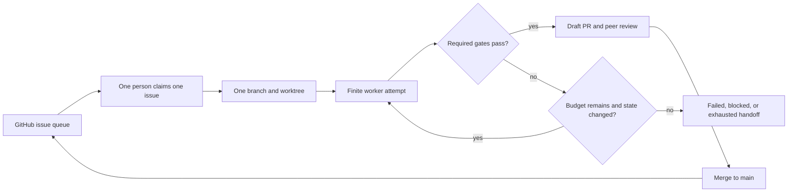

# Bounded Continuous Agent and Three-Person Workflow

This repository uses an outer GitHub coordination loop around finite local worker
attempts. It can keep accepting new work indefinitely, but no individual conversion
is allowed to retry forever.

Git is the synchronization layer. A local edit does not instantly appear on the other
machines. It becomes shareable after `commit` and `push`, and it reaches everyone after
the pull request is merged and they run `git pull --ff-only`.



## Current three-person split

Use the parent project issue as the shared queue:

- [Project issue #14](https://github.com/huluk98/c2hlsc-agent/issues/14)
- Person 1: [controller foundation #16](https://github.com/huluk98/c2hlsc-agent/issues/16)
- Person 2: [CoSim and batch loop safety #15](https://github.com/huluk98/c2hlsc-agent/issues/15)
- Person 3: [peer review and efficient CI #17](https://github.com/huluk98/c2hlsc-agent/issues/17)

Do not share a working branch and do not edit a sibling issue's owned files. Integration
happens through reviewed pull requests to `main`.

## Rules that prevent duplicate work

1. Start from one open issue and assign it to yourself before editing.
2. Comment with your branch name and exact owned file list.
3. Use one branch and one worktree per issue.
4. Push small checkpoints so peers can see progress, but do not push to another person's branch.
5. Open a draft pull request early and include `Closes #ISSUE` in its body.
6. Require a peer who did not author the change to review it.
7. Merge only after required tests pass; then everyone fast-forwards local `main`.

## Commands each peer runs

Replace `ISSUE`, `GITHUB_USER`, and `SHORT_NAME` with your values.

```powershell
git clone https://github.com/huluk98/c2hlsc-agent.git
cd c2hlsc-agent
git fetch origin --prune
git switch main
git pull --ff-only origin main

gh issue view ISSUE
gh issue edit ISSUE --add-assignee GITHUB_USER --remove-label status:todo --add-label status:in-progress
gh issue comment ISSUE --body 'Claimed. Branch: work/ISSUE-GITHUB_USER-SHORT_NAME. I will edit only the files listed in this issue.'

git switch -c work/ISSUE-GITHUB_USER-SHORT_NAME
git push -u origin work/ISSUE-GITHUB_USER-SHORT_NAME
```

Work only inside that branch. Before handing off, inspect and publish intentional files:

```powershell
git status --short
git diff --check
python -m unittest discover -s tests -v

git add path/to/file1 path/to/file2
git diff --cached
git commit -m 'Complete ISSUE scope (#ISSUE)'
git push

gh pr create --draft --base main --head work/ISSUE-GITHUB_USER-SHORT_NAME --title 'Complete ISSUE scope' --body 'Closes #ISSUE. Parent: #14. Includes tests and no sibling-owned files.'
gh issue edit ISSUE --remove-label status:in-progress --add-label status:review
```

After a pull request is approved and merged, every peer synchronizes:

```powershell
git switch main
git pull --ff-only origin main
git branch --merged main
```

Never use a shared Dropbox/Drive folder to live-sync a Git worktree. Git metadata and
build outputs can race or corrupt. Share source through branches and pull requests;
share runtime evidence by attaching logs to the owning issue or PR.

## Running a bounded conversion

The outer coordinator persists state in `PROJECT/run_ledger.jsonl`. The file is ignored
by Git because it is machine/runtime state, not source. Every event is a complete JSON
snapshot written atomically. Prompts, model responses, keys, and endpoint secrets are
not stored.

```powershell
python -m c2hlsc_agent convert `
  --input examples/vector_add/input.c `
  --top vector_add `
  --out c2hlsc_project `
  --run-vitis `
  --auto-repair `
  --max-iterations 3 `
  --max-wall-seconds 14400 `
  --max-llm-calls 8 `
  --max-vitis-runs 3
```

Inspect it without changing or resuming it:

```powershell
python -m c2hlsc_agent status --project c2hlsc_project
python -m c2hlsc_agent status --project c2hlsc_project --json
```

Run the same conversion command again to resume a `failed` or `blocked` run. Attempts,
LLM calls, Vitis runs, elapsed time, and repeated source/failure states remain counted.
Budgets cannot be increased on a run after it starts.

Use `--new-run` only after an intentional reset such as changed requirements, corrected
input, or an approved budget change:

```powershell
python -m c2hlsc_agent convert --input examples/vector_add/input.c --top vector_add --out c2hlsc_project --new-run
```

| Controller status | Meaning | Team action |
| --- | --- | --- |
| `running` | Work is active or was interrupted mid-session | Owning person continues; peers do not duplicate it |
| `passed` | Every required verification gate passed | Open or finalize the draft PR |
| `failed` | Verification failed and no safe automatic step remains | Add evidence and a concrete next action to the issue |
| `blocked` | Required input, model, tool, or human decision is missing | Name the blocker and owner in the issue |
| `exhausted` | A budget ended or the same state repeated | Stop automation; review before using `--new-run` |
| `cancelled` | A run was intentionally stopped | Record why before replacing it |

The existing report keeps `status: pass/fail` for verification compatibility and adds a
separate `run_control` object for the controller state. Never describe `failed`,
`blocked`, or `exhausted` as a successful conversion.

## Handoff between machines

Source handoff and runtime handoff are different:

- Source handoff: commit, push, open a draft PR, and link the issue.
- Runtime handoff: paste `status --json` into the issue and attach the generated project
  artifact, including `run_ledger.jsonl`, if the next person must resume the exact run.
- If generated evidence may contain proprietary source or secrets, use an approved
  private artifact channel and post only the artifact reference in GitHub.

Use this issue comment template:

```markdown
## Handoff

- Owner: @NAME
- Branch: `work/ISSUE-NAME-SHORT_NAME`
- Last pushed commit: `SHA`
- Run ID and status: `RUN_ID / STATUS`
- Attempts / LLM / Vitis: `A/MAX / L/MAX / V/MAX`
- Last required gate: `PHASE = RESULT`
- Evidence or artifact: `LINK`
- Files changed: `LIST`
- Exact next action: `ONE ACTION`
- Blocker owner, if any: `@NAME or none`
```

The receiving person comments that they accept ownership before starting. The previous
owner then stops writing to that branch and output directory. This keeps the ledger's
single-writer guarantee intact.

## The safe revolving coordinator cycle

The coordinator may run repeatedly or be triggered by issue/PR events, but each pass is
finite:

1. Read project issue #14 and its child issues.
2. Ignore issues already assigned or labelled `status:in-progress` or `status:review`.
3. Claim one ready issue with an owner, branch, and file scope.
4. Run one bounded worker session.
5. Publish a checkpoint or draft PR.
6. Set one truthful terminal or waiting status.
7. Stop. A later GitHub event starts the next coordinator pass.

The coordinator must never auto-merge, silently reset budgets, create duplicate issues,
or start two workers on the same issue. Human peer review remains the merge gate.

## Daily team check

Each person should be able to answer these before writing code:

- Which issue do I own?
- Which exact files may I edit?
- Which branch am I on?
- What is the latest pushed commit?
- What test proves this issue is done?
- Is the run `running`, `passed`, `failed`, `blocked`, or `exhausted`?
- Who reviews my pull request?

If any answer is unclear, update the issue first. The issue queue is the shared truth;
chat messages and local notes are supporting context only.
