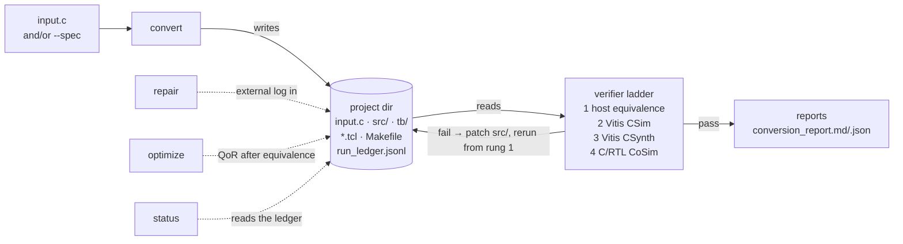
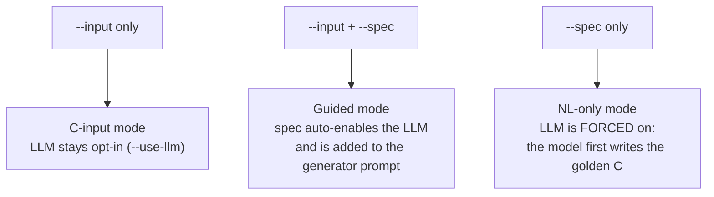
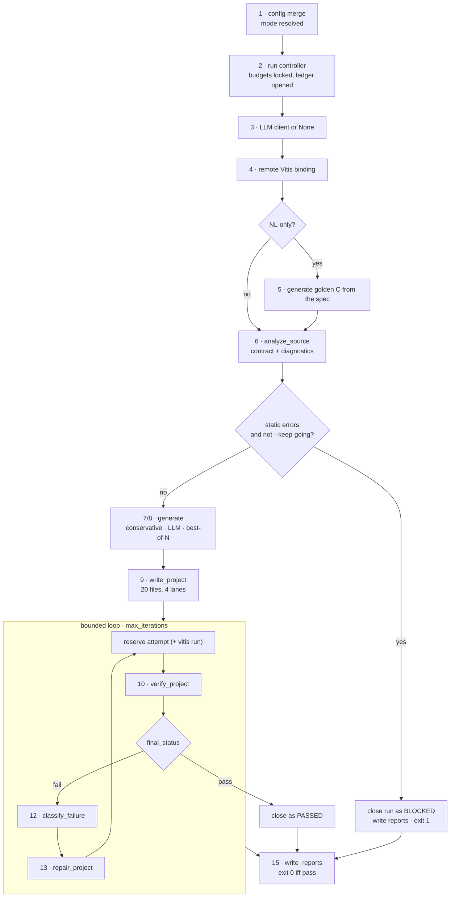
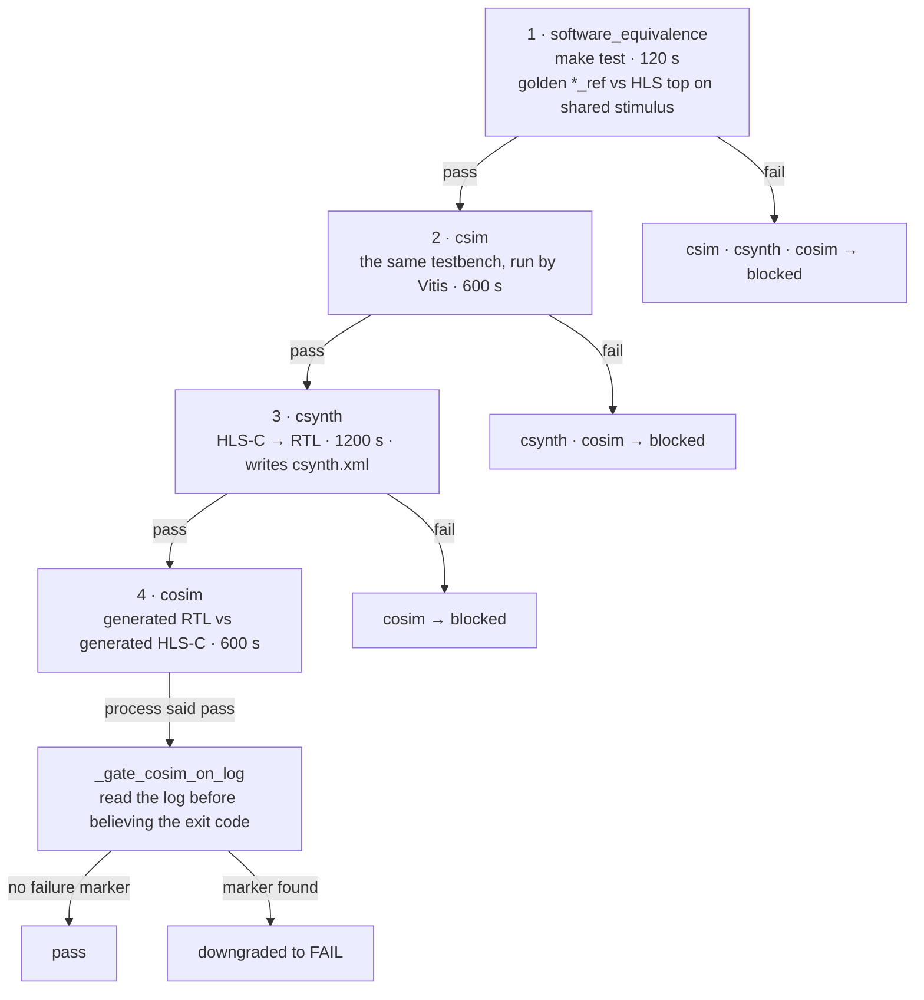
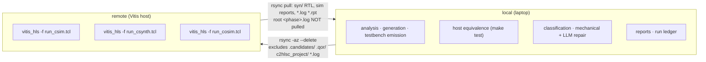
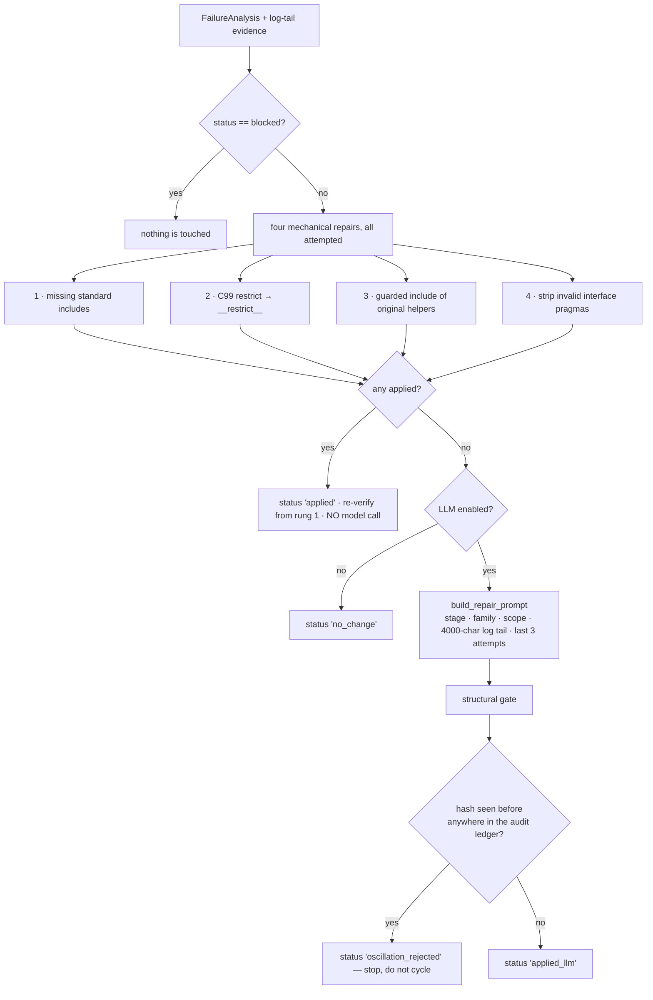
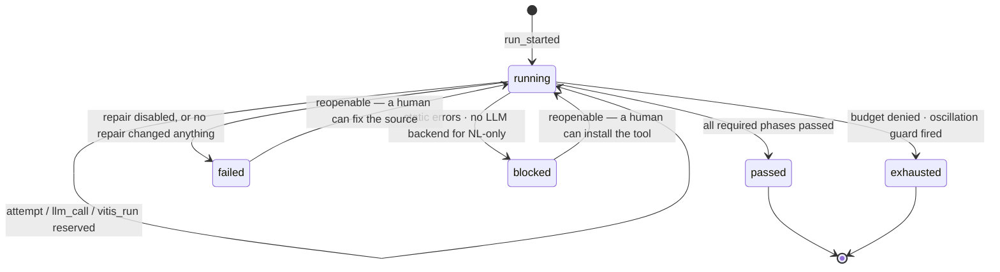
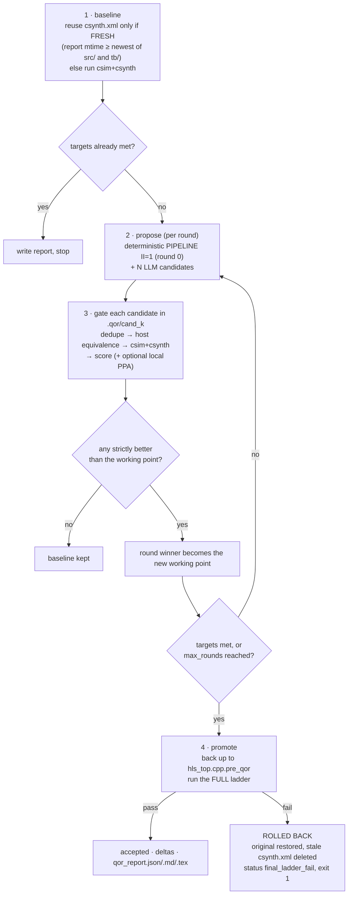
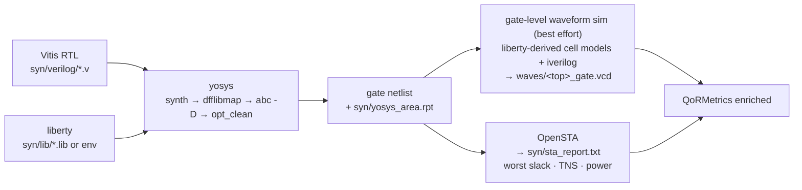
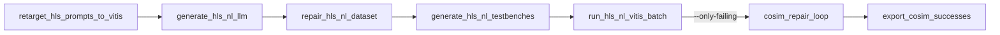

# The full c2hlsc-agent workflow

*Component-by-component map of what runs, in what order, and what each step generates.*

This page is the answer to two questions:

1. **Where does each component and each declared agent sit in the real pipeline?**
2. **What exactly is generated here, by what, and how much can it be trusted?**

Everything below was read from the source at the commit that introduced this file.
Where a claim is about behaviour rather than structure, it was reproduced by running the
code. `AGENT_SUMMARY.md` remains a useful per-function reference but predates the run
controller, the QoR stack, remote Vitis, the standalone RTL lane, best-of-N and NL-only
mode; this page supersedes it as the workflow description.

---

## Table of contents

- [1. The shape of the system](#1-the-shape-of-the-system)
- [2. Invariants everything is bent around](#2-invariants-everything-is-bent-around)
- [3. What is generated, and by what](#3-what-is-generated-and-by-what)
- [4. The `convert` pipeline, stage by stage](#4-the-convert-pipeline-stage-by-stage)
- [5. The verifier ladder](#5-the-verifier-ladder)
- [6. Failure classification and repair](#6-failure-classification-and-repair)
- [7. Bounded run control](#7-bounded-run-control)
- [8. `repair` — patching from external evidence](#8-repair--patching-from-external-evidence)
- [9. `optimize` — post-equivalence QoR](#9-optimize--post-equivalence-qor)
- [10. `status`](#10-status)
- [11. The three optional evidence lanes](#11-the-three-optional-evidence-lanes)
- [12. The dataset lane (`scripts/`)](#12-the-dataset-lane-scripts)
- [13. The eight agents: which are live](#13-the-eight-agents-which-are-live)
- [14. Governance, collaboration agents and CI](#14-governance-collaboration-agents-and-ci)
- [15. Module index](#15-module-index)

---

## 1. The shape of the system

`c2hlsc_agent` converts a C top function — or a natural-language spec — into a Vitis HLS
C/C++ project, then proves the result behaves like the original by climbing a
short-circuiting ladder of increasingly expensive checks.

Four CLI verbs share **one project directory** as their medium of exchange.



`convert` creates the directory, `repair` patches it from evidence gathered on another
machine, `optimize` improves its QoR once equivalence is locked, and `status` reads the
persistent run ledger that bounds all of them.

---

## 2. Invariants everything is bent around

These are stated in `AGENTS.md` and enforced structurally in code.

| # | Invariant | Where it is enforced |
|---|---|---|
| I | The original C is the only acceptance oracle. Generated or model-written HLS-C never becomes its own criterion. | `testgen.generate_testbench` compiles `input.c` with the top macro-renamed to `*_ref` |
| II | The original C is never handed to the model *as a target to copy* — it is compiled as an oracle. | repair prompts carry only the failing HLS-C and a log tail; `input.c` is never model-writable |
| III | The ladder short-circuits and never back-fills. A later rung cannot be claimed when an earlier one failed. | `hls_runner.verify_project` / `run_vitis` set downstream phases to `blocked` |
| IV | The deterministic offline path must keep working with no SDK, key or network. | CI runs the suite **without** installing `anthropic` |
| V | Every autonomous loop is bounded and durable. | `run_control.RunController` reserves attempts, wall time, model calls and Vitis runs before spending them |
| VI | No unearned claims. Host compilation is not CSim; CoSim is not proof that the original C equals the RTL. | `report.final_status`, the status vocabulary, and the standalone RTL lane |

### Status vocabulary — used exactly, never promoted

| Value | Means | Never means |
|---|---|---|
| `pass` | the phase ran and its verdict was positive | "probably fine", "not checked" |
| `fail` | the phase ran and its verdict was negative | the tool was missing |
| `blocked` | you asked for it, but an earlier phase made it unanswerable | the phase was skipped by choice |
| `skipped` | you did not ask for it | anything about correctness |

---

## 3. What is generated, and by what

This is the section to read if you want to know which bytes in a project came from a
model and which are deterministic.

### 3.1 The three generation modes



There is no `--mode` flag. The presence of `--input` and `--spec` decides, and the
decision writes back into the config so every later stage sees one consistent record
(`cli.run_convert`). `--candidates N` also auto-enables the LLM path. If `--no-llm` was
given explicitly, the run says so on stderr and stays deterministic — except in NL-only
mode, which cannot exist without a model.

### 3.2 Every generated artifact

`write_project` emits 20 tracked files plus `run_all.sh`. Everything in the "Produced by"
column marked **deterministic** is byte-reproducible from the analysis result and config.

| Path | Produced by | Deterministic? | Purpose |
|---|---|---|---|
| `input.c` | `shutil.copyfile` of the source (or the NL reference) | yes | **the golden oracle**; never model-writable |
| `nl_reference.c` | `convert.generate_reference_c` | **no — model** | NL-only mode only; becomes `input.c` |
| `src/hls_top.hpp` | `convert._generate_conservative_sources` | yes | generated header: includes, signature |
| `src/hls_top.cpp` | `convert.generate_hls_sources` | **only in the deterministic path** | the design under test; the *only* model-writable file |
| `tb/testbench.cpp` | `testgen.generate_testbench` | yes | golden-vs-HLS host equivalence harness |
| `tb/leveri_golden_tb.cpp` | `leveri_testgen` | yes | golden trace dumper (CSV) |
| `tb/leveri_hls_tb.cpp` | `leveri_testgen` | yes | HLS trace dumper (CSV) |
| `tb/leveri_compare.py` | `leveri_testgen` | yes | static schema + dynamic value comparator |
| `tb/leveri_manifest.json` | `leveri_testgen` | yes | policy, checks, argument metadata |
| `tb/run_gcov.py` | `leveri_testgen` | yes | coverage build/run/report |
| `tb/klee_driver.cpp` | `leveri_testgen` | yes | KLEE symbolic driver over the golden top |
| `tb/run_klee.py` | `leveri_testgen` | yes | env-resolved KLEE runner, skips cleanly |
| `tb/rtl_vectors_tb.cpp` | `verilog_testgen` | yes | golden C → `rtl_vectors/*.mem` |
| `tb/gen_rtl_tb.py` | `verilog_testgen` | yes | renders `<top>_tb.sv` from contract or real RTL |
| `tb/run_rtl_sim.py` | `verilog_testgen` | yes | drives xsim or iverilog, writes a JSON report |
| `tb/rtl_tb_manifest.json` | `verilog_testgen.build_spec` | yes | ports, widths, reset polarity, depths |
| `run_hls.tcl` | `hls_project.render_run_hls` | yes | the whole ladder in one shot |
| `run_csim.tcl` / `run_csynth.tcl` / `run_cosim.tcl` | `hls_project` | yes | split per phase so failures are attributable |
| `Makefile` | `hls_project.render_makefile` | yes | one target per evidence lane |
| `run_all.sh` | `hls_project.render_run_all` | yes | `make test`, then `vitis_hls` if present |

Artifacts written **during** a run rather than at emission time:

| Path | Written by | Contents |
|---|---|---|
| `<phase>.log` | `equivalence.run_command` | stdout + stderr of each phase, **including on timeout** |
| `run_ledger.jsonl` | `run_control.RunLedger` | one complete snapshot per event, atomically appended |
| `repair_audit.json` | `hlsc_repair_agent` | every repair outcome, with before/after SHA-256 and a unified diff |
| `conversion_report.md` / `.json` | `report.write_reports` | status, contract, transformations, phases, repairs, run control |
| `manual_repair_report.json` | `cli.run_repair` | external-evidence repair outcome and next step |
| `candidate_scores.json` | `cli.run_convert` | best-of-N host-equivalence scores |
| `qor_report.json` / `.md` / `qor_table.tex` | `qor_optimizer._write_reports` | baseline vs optimized deltas, three renderings |
| `syn/yosys_area.rpt`, `syn/sta_report.txt` | `local_ppa` | std-cell area; slack and power |
| `coverage/rtl_tb_report.json`, `coverage/gcov_report.json` | the lane scripts | lane verdicts with command logs |

### 3.3 Where a model is actually called

There are exactly **three model call sites in the package** and one more in `scripts/`.
Every one of them returns an artifact the verifier can check.

| Site | Function | Generates | Gate applied to the output |
|---|---|---|---|
| 1 | `convert.generate_hls_sources` → `_llm_candidate` | `src/hls_top.cpp` | `extract_hls_source`: fence extraction → must define the top → braces balanced → header include prepended. Failure ⇒ conservative copy |
| 2 | `hlsc_repair_agent._llm_repair` | `src/hls_top.cpp` only | `extract_full_file` + `is_plausible_translation_unit` + hash never seen before in the audit ledger |
| 3 | `qor_optimizer._llm_candidate_source` | a QoR candidate `hls_top.cpp` | same structural gate, then host equivalence, then csynth, then the full ladder before promotion |
| — | `scripts/cosim_repair_loop.py` | `dut.cpp` per dataset record | re-run the Vitis cosim ladder |
| — | `convert.generate_reference_c` | `nl_reference.c` (NL-only) | `extract_reference_c`; then it *becomes* the oracle |

The last row is the one asymmetry worth internalising: in NL-only mode the oracle itself
is generated. Everything downstream still works, but the equivalence claim is
"equivalent to the reference the model wrote from your spec", not "equivalent to code you
wrote". If that reference leaves an array parameter unbounded, the run warns loudly,
because the testbench then has to guess a length of 16 and may drive it unsoundly.

### 3.4 The deterministic floor

The conservative generator is built **first, always**, even when the LLM path is on
(`convert.generate_hls_sources`). It is a verbatim copy of the original top-function body
in a generated wrapper, with interface pragmas only if `interface_mode` asks for them,
and **no performance pragmas at all** — no pipeline, unroll, dataflow or array partition.
Every model failure path falls back to it, with the concrete reason recorded in the
transformation ledger that ends up in `conversion_report.md`.

---

## 4. The `convert` pipeline, stage by stage



### Stage 1 — config merge and mode resolution
`config.load_config` → `config.merge_cli_config` → `cli.run_convert`

A YAML/JSON config is loaded, then CLI flags override it. Two subtleties:
`--use-llm/--no-llm` and `--run-vitis/--no-run-vitis` are **explicit-only** overrides, so
an absent flag never clobbers a config value; and `keep_going` is only ever raised to
true. When PyYAML is absent, `_minimal_yaml` parses an indentation-based subset — its
comment stripper is quote-aware precisely because `nl_spec` is free text and a naïve
`split('#')` would corrupt a spec like `"count the # of set bits"`.

`C2HLSC_VITIS_SSH` is folded in here rather than in `RemoteVitis`, so that the rule
"a remote host implies `--run-vitis`" also applies to the environment-variable route.

### Stage 2 — the persistent run controller
`cli._run_identity` → `run_control.RunController` → `run_ledger.jsonl`

Covered in detail in [§7](#7-bounded-run-control).

### Stage 3 — resolving an LLM backend
`llm.resolve_backend` → `llm.build_llm_client`

```mermaid
flowchart TD
    A{"llm_backend"} -->|explicit| B["honoured verbatim"]
    A -->|auto| C{"explicit base URL?"}
    C -->|yes| D["OpenAICompatibleLLMClient"]
    C -->|no| E{"`claude` on PATH?"}
    E -->|yes| F["ClaudeCLIClient<br/>subscription auth, no key"]
    E -->|no| G{"anthropic SDK + key?"}
    G -->|yes| H[AnthropicLLMClient]
    G -->|no| I{"OPENAI_API_KEY?"}
    I -->|yes| D
    I -->|no| J["none → deterministic path"]
    D --> K[BudgetedLLMClient wrapper]
    F --> K
    H --> K
```

`claude-cli` shells out to the local Claude Code CLI (`claude -p --model <model>`) with
`system + user` on stdin. It uses whatever subscription the CLI is logged in as — no API
key, no per-token billing — which is why `auto` prefers it. The command string is
shlex-split, so `--llm-cli-cmd "ssh you@mac claude"` puts the model on another machine.

Construction never networks; only `complete()` does. Unavailability is diagnosed by
`missing_llm_reason` and printed before the fallback. A non-local OpenAI-compatible
endpoint with no key deliberately returns `None` rather than a client guaranteed to 401.

### Stage 4 — binding the remote Vitis host
`remote.RemoteVitis.from_config`

Cheap stage, big consequence: **only `vitis_hls` ever leaves the local machine.**
Analysis, generation, testbench emission, host equivalence, classification and LLM repair
all stay local. Mechanics in [§5.2](#52-running-vitis-on-another-machine).

### Stage 5 — NL-only golden reference
`convert.generate_reference_c`

Only runs when there is no input C. The model writes a plain-C reference, it is saved as
`nl_reference.c`, assigned to `config.input_files`, and from there the pipeline is
identical to the C-input modes. Two failures are distinguished on purpose:

- the backend **call** raised (CLI error, timeout, auth) → `ReferenceGenerationError` → run closes as `BLOCKED`;
- the model answered but the output is unparsable → run closes as `FAILED`.

Conflating them would tell a user to refine their prompt when their SSH tunnel is down.

### Stage 6 — static analysis
`analyze.analyze_source`

Regex-based and deliberately clang-free. Comments are stripped, the top function is
brace-matched, and each parameter is parsed into a `FunctionArg`. `restrict` and
`__restrict__` are stripped from both the raw text and the type, because the generated
file is compiled as C++.

Direction inference: a parameter is an output if written, using the pattern `=(?!=)` —
the negative lookahead is what stops `==` from counting as a write. Reads are detected
*after* removing the left-hand sides of writes, so a pure output buffer is not misread as
`inout`. Config metadata overrides inference.

Missing pointer bounds default to length 16 with a `missing-pointer-bound` warning.

Ten rejection checks emit `severity=error` diagnostics: dynamic allocation; unsupported
stdlib calls (`rand`, `qsort`, `exit`, …); system calls; file/console I/O; function
pointer calls; unbounded loops; recursion on the top; unrestricted pointer arithmetic per
argument; and variable-length arrays. Each carries a `suggestion` naming the refactor.

With errors present and no `--keep-going`, nothing is generated: reports are written, the
run closes as `BLOCKED`, exit 1. With `--keep-going`, the project is emitted but
`final_status` still returns `fail` — a design with a `malloc` in the top cannot pass by
getting lucky in CSim.

### Stages 7–8 — generation and best-of-N
`convert.generate_hls_sources` · `candidates.select_best_candidate`

With `--candidates N`, N independent generations are requested (prompted to take
different strategies from attempt 2 onward), deduplicated by whitespace-normalized
source, staged into `<out>/.candidates/cand_k`, and scored with **host equivalence only**
— a `g++` build and run that takes seconds. Only the winner is handed to Vitis.

Selection order:

1. the first candidate that passes with zero mismatches wins immediately;
2. otherwise the candidate with the **largest `first_failure_index`** wins;
3. otherwise the conservative deterministic copy, with no extra unscored model call.

Rule 2 exists because the generated testbench exits on the first mismatch, so every
failing candidate reports exactly one — counting mismatches cannot rank them. The test
index where the run broke can: a candidate that survived 47 tests is a strictly better
repair starting point than one that broke on test 0.

### Stage 9 — project emission
`hls_project.write_project`

See [§3.2](#32-every-generated-artifact) for the file list. Two wiring details matter:

- `tb/testbench.cpp` includes `../input.c` inside `extern "C"` with the top macro-renamed
  to `*_ref` and `restrict` defined away — that is how the oracle gets into the harness
  without the model ever seeing it as a target.
- Output comparison **clamps to an active-length scalar** when one is detectable
  (`_looks_like_length_name` / `_active_length_arg`). For `void f(const int *in, int *out,
  int n)` only the first `n` elements of `out` are contractually defined; comparing all 16
  would fail a correct design on the untouched tail.

Stimulus is `mt19937_64(seed)` plus directed patterns (zeros, all-ones, min/max,
alternating), output buffers are sentinel-filled so a missed write is visible, and float
comparison uses a relative tolerance of 1e-6.

---

## 5. The verifier ladder

`hls_runner.verify_project` → `run_software_equivalence` → `run_vitis`

Four rungs, each strictly more expensive and more meaningful than the last. A failure at
any rung marks everything above it **`blocked`**, never `skipped` and never `pass`.



### 5.1 The CoSim log gate

Vitis can exit 0 while its own log reports a co-simulation mismatch. Trusting the exit
code would let a non-equivalent design pass the strongest rung on the ladder.
`cosim_verdict.evaluate_cosim_verdict` scans stdout, stderr **and the written log file**
for four markers — `co-simulation finished: fail`, `cosim design failed`,
`co-simulation failed`, `aborting cosim` — and downgrades a pass to a fail on any hit.
Only a pass is ever downgraded; timeouts, failures, blocked and skipped are untouched.
Because it reads the local log, it works identically for SSH-remote runs.

### 5.2 Running Vitis on another machine

`remote.push` / `run_phase` / `pull`



Three things that would otherwise go wrong, and how they are handled:

- **Collision.** The remote leaf is `<basename>-<sha1 of the absolute local path>`, so two
  projects both called `out` never share a directory under `--delete`.
- **Evidence loss.** Pulling `*.log` back would overwrite the fresh local ssh console
  output with a stale remote copy, so both rsyncs exclude them.
- **Misdiagnosis.** Exit 124/137 is relabelled as a timeout and exit 255 as
  `remote vitis unavailable`, so an SSH blip is classified `toolchain_unavailable`
  (blocked, no repair) instead of letting auto-repair mutate correct source.

Each phase runs under a remote `timeout -k 30s <t>s` so the remote guard fires before the
local ssh grace expires. With no explicit `--vitis-setup`, the remote shell probes
sixteen common `settings64` locations and, on a miss, emits the exact string
`vitis_hls not found` — chosen because the local classifier greps for it.

### 5.3 The execution primitive

`equivalence.run_command` runs each phase in its own session so a hung `vitis_hls` can be
killed as a **process group** (SIGTERM, then SIGKILL after 10 s). The partial log is
written to `<phase>.log` **before** the timeout exception is raised, so a timed-out phase
still gives the repair agent real evidence rather than a one-line summary.

`run_vitis(upto=...)` stops the ladder at `csim` or `csynth` — that is what makes the QoR
optimizer affordable, since it scores candidates at `csynth` and pays for CoSim only on
the promoted winner.

---

## 6. Failure classification and repair

### 6.1 Classification

`agent_loop.classify_log_family` is pure text triage over the earliest failing phase's
summary, stdout and stderr. Nine families, matched in a strict priority order:

`toolchain_unavailable` → `timeout_or_deadlock` → `behavioral_mismatch` →
`interface_contract` → `memory_pointer` → `numeric_bitwidth` → `loop_scheduling` →
`non_synthesizable_construct` → a per-phase default.

Toolchain is first on purpose: a missing tool must never be re-read as a bit-width or
pointer bug.

`agent_loop.classify_failure` then turns a family plus a phase into a routed decision —
owning agent, next action, evidence needed, and **repair scope** (the bound on what may
be touched).

| Situation | Owner | Status |
|---|---|---|
| static diagnostics have errors | `contract_planner` | needs_action |
| host fail + `behavioral_mismatch` | `failure_analyst` | needs_action |
| host fail, any other family | `shift_left_testbench_agent` | needs_action |
| any phase + `toolchain_unavailable` | `cosim_operator` | **blocked** |
| Vitis requested but not enabled | `cosim_operator` | **blocked** |
| `csynth` fail | `hlsc_repair_agent` | needs_action |
| `cosim` mismatch / failure / timeout | `failure_analyst` (PMLC) | needs_action |
| everything passed | `rtl_optimizer_agent` | **pass** |

### 6.2 Repair

`hlsc_repair_agent.repair_project`



Deterministic repairs are tried first because a model call is expensive,
budget-consuming and non-reproducible, whereas a missing `#include <string.h>` is none of
those things.

**The hard boundary:** `_llm_repair` may rewrite `src/hls_top.cpp` and nothing else.
`input.c`, `tb/testbench.cpp`, the TCLs and the Makefile are never handed to the model and
never overwritten by it. That is what makes a wrong patch produce a failed verification
rather than a false pass.

Every outcome — including `no_change`, `blocked` and `oscillation_rejected` — is appended
to `repair_audit.json` with per-file SHA-256 before/after and a unified diff. The next
iteration's prompt reads that ledger back as history.

### 6.3 Termination — three guards that do not overlap

| Guard | Compares | Scope | Catches |
|---|---|---|---|
| Budget | counts vs limits | persistent | too much of anything |
| Failure fingerprint | `(source hash, normalized failure evidence)` | persistent | same state, same failure, twice |
| Project signature | SHA-256 of `hls_top.cpp` + `.hpp` | this invocation | A → B → A revert cycles |

The normalization in `_normalize_failure_evidence` is what makes the second guard work:
raw Vitis logs contain timestamps, hex addresses and absolute paths that differ every
run, so two identical failures would never hash the same. They are replaced with
`<timestamp>`, `<address>`, `<path>`, whitespace is collapsed, and the last 4000
characters are kept.

Two ordinary exits complete the set: `auto_repair` is off (`FAILED`, "bring Vitis
evidence back with the repair command"), and `repair.changed` is false (`FAILED`, "no
safe repair changed the failing project"). Only a `pass` returns exit code 0.

---

## 7. Bounded run control

`run_control.py` — this is what makes the agent safe to leave alone.

Before any work happens, the run's **identity** is fingerprinted: a SHA-256 over source
hashes, the NL spec, top name, part, clock, seed, argument metadata, compiler flags, test
count, interface mode, cosim tool, RTL language, and the LLM backend and model. That
derives a stable `run-<16 hex>` id, so re-running the same conversion resumes the same
budget rather than starting fresh.

The ledger is JSONL where **every line is a complete snapshot**, not a delta. Appends are
atomic: previous content plus the new line is written to a uniquely-named temp file,
`fsync`'d, and `os.replace`'d over the target. A ledger whose final line lacks a newline
is refused as corrupt.



`passed`, `exhausted` and `cancelled` are **closed** — reusing that run id is refused.
`failed` and `blocked` stay reopenable on purpose: those are states a human can fix, and
the next invocation should pick up the same budget where it left off. `exhausted` is
closed because retrying it is exactly the runaway behaviour the controller prevents.

Three refusals keep budgets meaningful across invocations: a run id whose inputs changed,
a budget changed on an existing run id (**budgets are immutable**; `--new-run` is the only
way past), and a run already in a closed status.

**Reserve before you spend.** Each of `reserve_attempt`, `reserve_llm_call` and
`reserve_vitis_run` re-checks wall time, then either increments usage and writes a ledger
event or writes `budget_denied` and raises `RunBudgetExceeded(resource)`.

One asymmetry, implemented by `cli._permit_optional_llm_fallback`: **only an `llm_calls`
denial is recoverable.** The model was always a proposal mechanism, so the run continues
deterministically. An exhausted attempt, Vitis or wall budget closes the run as
`exhausted` and hands off to a human.

`BudgetedLLMClient` counts calls and logs a purpose string, and explicitly never stores
prompts, responses, keys or endpoints in the ledger; a failed call is logged by exception
*type* only.

A real run, reproduced from this repository:

```console
$ python -m c2hlsc_agent.cli convert --config examples/vector_add/config.yaml --out build/va
g++ -std=c++17 -Wall -Wextra -I src  tb/testbench.cpp src/hls_top.cpp -o c2hlsc_tb
./c2hlsc_tb
c2hlsc_agent: all 64 tests passed, seed=7

# run_ledger.jsonl — four events, one complete snapshot each
run_started            running  attempts=0 llm=0 vitis=0
attempt_reserved       running  attempts=1 llm=0 vitis=0
verification_recorded  running  attempts=1 llm=0 vitis=0
run_finished           passed   attempts=1 llm=0 vitis=0  "all required verification phases passed"
```

`vitis=0` because this run was not asked to run Vitis — the three Vitis phases are
`skipped`, not `pass`, and the report says so.

---

## 8. `repair` — patching from external evidence

The split-machine workflow in one command: generation happens where the model is, Vitis
happens where the licence is, and this brings the log back.

`cli._external_failure_state` synthesizes a `VerificationState` from one declared stage:

- phases **before** the declared stage are assumed `pass` (the external run got past them);
- the declared stage is `fail` and carries the evidence text;
- later phases are `blocked`;
- the declared stage is force-appended to the plan if it is not in the normal order.

Those assumed passes are an honest fiction used to route the repair correctly. They are
never written into a conversion report as observed evidence.

From there it is the ordinary path: re-run `analyze_source` on `PROJECT/input.c`,
`classify_failure`, `repair_project`, then write `manual_repair_report.json` and append to
`repair_audit.json`. `--top` defaults from `conversion_report.json` and `--input` from
`PROJECT/input.c`, so the usual invocation is a project, a stage and a log:

```bash
python -m c2hlsc_agent.cli repair \
  --project build/vector_add \
  --stage cosim \
  --evidence /path/from/vitis_machine/vitis_cosim.log
```

**Exit 0 iff a change was applied.** This command reports "did I patch something", not
"is it correct now" — the report's `next_step` says plainly to rerun verification from
the beginning on the Vitis machine.

---

## 9. `optimize` — post-equivalence QoR

`qor_optimizer.optimize_project` — this is `rtl_optimizer_agent` as live code, and the one
place the agent may change the design for reasons that are not correctness. The price of
admission is that the full ladder must pass again.



**Objectives** (lower is better):

| Objective | Score | Fallback |
|---|---|---|
| `latency` | worst-case latency in cycles | max initiation interval |
| `area` | LUT + FF/2 + 100·DSP + 100·BRAM + 300·URAM | whatever fields are present |
| `balanced` | (latency ratio) × (area ratio) vs baseline | `None` if a baseline term is zero |

With `--target-*` flags, selection is **lexicographic: gap score first, then objective
score** — a candidate that closes more of the distance to the stated targets beats one
with a better raw latency. `evaluate_targets` counts a target whose metric is simply
missing as fully unmet: a measurement you did not take is never evidence you passed.

Candidate statuses: `duplicate`, `equiv_fail`, `csim_fail`, `csynth_fail`, `unparsable`,
`timing_regressed`, `scored`, `final_ladder_fail`. `timing_regressed` means the candidate
broke the target clock when the baseline met it — excluded from selection even if its
score improved.

Three details that are load-bearing:

- **Freshness.** The baseline reuses an existing `csynth.xml` only if it postdates the
  sources it claims to describe. `repair` rewrites `src/` without re-synthesizing, so a
  stale report would lie.
- **Rollback deletes the stale report.** Leaving the rejected candidate's `csynth.xml`
  behind would make the next `optimize` run adopt a rejected design's numbers as baseline.
- **The backup is never clobbered.** On repeated runs `hls_top.cpp.pre_qor` must keep
  holding the true pre-QoR original, not the previous run's already-optimized source.

`optimize` exits 1 in three cases that are **not** a QoR verdict: rolled back after the
acceptance ladder failed; explicit targets requested and not reached; or every candidate
died before scoring — that last one is checked specifically so a toolchain outage is
reported as infrastructure rather than "no improvement found".

### 9.1 The local PPA step

`local_ppa.run_local_ppa` — Vitis csynth gives FPGA *estimates*. Slack, std-cell area and
power targets need a real mapped netlist, so `--target-slack/-area/-power` or an explicit
`--local-ppa` turn on a three-step ASIC-style flow that runs entirely locally against the
RTL Vitis produced.



Every missing piece narrows the claim instead of crashing: no RTL → skipped ("run csynth
first"); no liberty or no yosys → skipped with a reason; no OpenSTA → area only, no slack
or power; no iverilog → gate sim skipped, flow continues. If STA emits an `Error` line the
report is renamed to `sta_report.failed.txt` so it can never be parsed as measurements,
and stale reports are deleted **before** any tool runs so a mid-flow crash cannot leave an
old revision's numbers to be read as current.

Cells the liberty-to-Verilog translation cannot model are skipped rather than guessed;
the simulation then fails to compile, which is reported — deliberately chosen over
silently mis-modelling a cell and producing a confident wrong waveform. The gate sim only
passes on an explicit `RTL_TB: PASS` marker; a silent run is a failure.

---

## 10. `status`

Reads `run_ledger.jsonl`, takes the latest event for the run (or a named `--run-id`), and
prints run id, status, reason, and usage against each of the four budgets. `--json` emits
the full snapshot including remaining headroom per resource. This is the command to reach
for when an autonomous run stopped and you need to know why.

---

## 11. The three optional evidence lanes

Generated into **every** project, run by **none** of the automated loops. That is
deliberate: if `make gcov-coverage` ran on every iteration, a coverage number would start
to look like a pass criterion, and coverage is not equivalence. They exist so a human can
substantiate a specific additional claim.

| Lane | Targets | Answers | Make target |
|---|---|---|---|
| **A · LeVeri paired traces** | `leveri_golden_tb`, `leveri_hls_tb`, `leveri_compare.py` | *where* did the two implementations diverge? | `leveri-test` |
| **B · coverage** | `run_gcov.py`, `klee_driver.cpp`, `run_klee.py` | did the stimulus even *reach* the code? | `gcov-coverage`, `klee-coverage` |
| **C · standalone RTL** | `rtl_vectors_tb.cpp`, `gen_rtl_tb.py`, `run_rtl_sim.py` | does the synthesized RTL match the **golden C**, without asking Vitis? | `rtl-vectors`, `rtl-testbench`, `rtl-cosim` |

**Lane A** writes two CSV traces and compares them on both a static tier (header row, role
row of `meta`/`in`/`out`, cycle count, and every stimulus column must match exactly) and a
dynamic tier (outputs with float tolerance). Arrays expand per element; `inout` splits
into `_in`/`_out` columns.

**Lane B** — gcov passes iff instrumentation produced data, treating gcov's own exit code
as advisory. KLEE resolves its binaries from the environment (no hardcoded paths) and
skips cleanly when they are missing.

**Lane C is the direct answer to invariant VI.** Vitis CoSim compares generated RTL
against generated HLS-C — it never sees the original C. This lane drives the RTL with
vectors the *golden* C produced, which is a different and stronger claim. Its
`gen_rtl_tb.py --from-rtl` mode parses the **synthesized** module for true port names,
widths, reset polarity (`ap_rst` vs `ap_rst_n`), `ap_continue` presence and memory shape,
then reconciles the contract against them. Guard rails: it never fabricates a return
comparison from a stray `ap_return` port; float compares are advisory; identifiers
colliding with Verilog keywords are emitted escaped; AXI interface modes are flagged as
unmodelled.

All three degrade to `skipped` with a reason rather than failing when their tools are
absent, so a generated project stays portable to a machine with nothing but a compiler.

---

## 12. The dataset lane (`scripts/`)

A separate pipeline that runs the same ideas at corpus scale over HLS_NL-style
natural-language → HLS-C records.



| Script | What it does |
|---|---|
| `retarget_hls_prompts_to_vitis.py` | rewrites Vivado-era wording to Vitis, reports edit counts and stragglers |
| `generate_hls_nl_llm.py` | threaded, resumable batch generation through four backends (openai / anthropic / reference / replay) |
| `repair_hls_nl_dataset.py` | auditable mechanical repair; accept / quarantine / delete, with unbounded-loop records **deleted** (code omitted, hashes kept) |
| `generate_hls_nl_testbenches.py` | stimulus-only driver testbenches by default; `--oracle semantic` heuristic checks are opt-in because they can false-fail |
| `run_hls_nl_vitis_batch.py` | csim → csynth → cosim per record, process-group-safe with per-phase timeouts; a `pass` additionally requires synthesized Verilog to exist on disk |
| `cosim_repair_loop.py` | closed loop: fail → `claude -p` repair → re-cosim; resumable, fingerprinted, dead-lettered |
| `export_cosim_successes.py` | refuses non-full-cosim reports unless `--allow-non-cosim`; exports a clean corpus with evidence |
| `run_vitis_bundle.py` | unpacks and runs a portable JSON bundle (path-traversal guarded) |
| `run_vitis_with_bin.py` | resolves an explicit `vitis_hls`, then execs `convert --run-vitis` |
| `collect_debug_bundle.py` | tarball of reports, phase logs, TCLs, sources and testbench |

`cosim_repair_loop.py` is the design template for a real agent: it drives the local
`claude` CLI by default (subscription auth, no API key), and
`--claude-cmd "ssh you@mac claude"` lets a Vitis server call back to a laptop for the
model. Its per-record state machine mirrors the main loop's — immutable retry budgets
that must match on resume, failure fingerprints, retryable infrastructure errors kept
distinct from non-retryable configuration errors, and a dead-letter status for records
that can never make progress.

---

## 13. The eight agents: which are live

`agent_loop.multi_agent_procedures()` declares eight agents with roles, owned
responsibilities, inputs, outputs and stop conditions. They are **declarative role
descriptions** — rendered into reports and docs, not executable agents. What *is* live:
the routing table that assigns failures to them, and the model call sites.

| Declared agent | What actually runs today | Status |
|---|---|---|
| `contract_planner` | `analyze.analyze_source` — regex inference, no model | deterministic |
| `shift_left_testbench_agent` | `testgen` + `leveri_testgen` + `verilog_testgen` | deterministic |
| `hlsc_generator_agent` | `convert.generate_hls_sources` — **live model call site 1** | live, verifier-gated |
| `cosim_operator` | `hls_runner.verify_project` — the ladder itself | deterministic |
| `failure_analyst` | `agent_loop.classify_failure` — regex triage; routing is live | **seam** |
| `hlsc_repair_agent` | `hlsc_repair_agent._llm_repair` — **live model call site 2** | live, verifier-gated |
| `rtl_optimizer_agent` | `qor_optimizer.optimize_project` — **live, its own command** | live, verifier-gated |
| `audit_memory_agent` | `repair_audit.json` — persisted, but never retrieved from | **seam** |

### The two remaining seams

- **`failure_analyst`** — a model-backed classifier would replace regex triage while
  returning the same `FailureAnalysis` dataclass. Near-zero risk, because the output shape
  is already the contract, and the `Mismatch` records plus phase logs are already
  structured evidence. For CoSim mismatches it would add PMLC-style slicing.
- **`audit_memory_agent`** — would promote audited repair successes from
  `repair_audit.json` into retrieval for future prompts.

Two more increments are specified but unbuilt: model-proposed argument
directions/bounds feeding `ArgumentConfig` (`contract_planner`), and coverage-driven
testbench augmentation on top of the deterministic floor.

### What must not break when agents are added

The structural gates (`extract_hls_source`, `is_plausible_translation_unit`), the
deterministic fallback in `generate_hls_sources`, the never-hand-the-original-C-over rule,
`_gate_cosim_on_log`, the repair audit provenance, and the oscillation guards. Every one
of those exists because a model can be confidently wrong.

---

## 14. Governance, collaboration agents and CI

Three narrowly-scoped project agents live in `.codex/agents/`:

| Agent | Sandbox | Owns |
|---|---|---|
| `coordination_explorer` | read-only | preflight: ownership, branch state, overlap, evidence tiers → one safe next action |
| `bounded_implementer` | workspace-write | edits **only** after preflight passes, only inside the claimed issue's scope |
| `verification_reviewer` | read-only | reviews correctness, evidence integrity, overlap, merge readiness |

**None** of them may assign or comment on issues, commit, push, open or update PRs,
approve, merge, rewrite history, or spawn subagents. The parent agent owns every Git and
GitHub write. Maximum three concurrent threads per session.

The workflow they enforce: one issue → one owner → one `work/<issue>-<user>-<slug>` branch
→ draft PR early with `Closes #N` → non-author approval → squash merge, never auto-merge.
Exactly one status label at a time (`status:todo`, `status:in-progress`, `status:review`,
`status:blocked`). The repository skill `$coordinate-team-work` drives all of it;
`COLLABORATOR_START_HERE.md` is the human entry point.

**CI mechanizes invariant IV.** `.github/workflows/ci.yml` runs
`python -m unittest discover -s tests` across Ubuntu 3.10/3.11/3.12 and Windows 3.12,
deliberately **without** installing the `anthropic` package, so the suite exercises the
deterministic generator and the LLM-unavailable fallback paths. A gate job named `ci`
then requires every matrix leg to have succeeded. Helper syntax checks cover
`scripts/team_preflight.sh`, `scripts/team_preflight.ps1` and
`scripts/verify_github_guardrails.py`.

---

## 15. Module index

| Module | Lines | Owns |
|---|---|---|
| `cli.py` | 780 | four subcommands and the bounded convert loop |
| `config.py` | 300 | `AgentConfig`, dependency-free YAML subset, CLI merge |
| `analyze.py` | 250 | top-function extraction, direction inference, rejection checks |
| `diagnostics.py` | 50 | `Diagnostic` / `DiagnosticBag` value types |
| `hlsc_generator.py` | 144 | the generator prompt contract, no I/O |
| `convert.py` | 211 | conservative + LLM generation, NL reference |
| `candidates.py` | 119 | best-of-N scoring by local host equivalence |
| `llm.py` | 689 | four backends, all prompt builders, response gating |
| `testgen.py` | 290 | the golden-C oracle testbench |
| `leveri_testgen.py` | 714 | paired traces, comparator, gcov and KLEE hooks |
| `verilog_testgen.py` | 1087 | golden vectors, RTL TB renderer, port reconciliation |
| `hls_project.py` | 215 | TCL renderers, Makefile, project emission |
| `equivalence.py` | 140 | `PhaseResult`, mismatch parsing, process-group runner |
| `hls_runner.py` | 184 | the ladder, short-circuiting, the CoSim log gate |
| `cosim_verdict.py` | 44 | the four failure markers and the downgrade rule |
| `remote.py` | 203 | rsync push/pull, per-phase SSH, failure relabelling |
| `agent_loop.py` | 301 | eight declared agents, log triage, failure routing |
| `hlsc_repair_agent.py` | 536 | four mechanical repairs, LLM repair, audit ledger |
| `run_control.py` | 564 | budgets, atomic ledger, fingerprints, budgeted client |
| `qor.py` | 402 | metric parsing, deltas, objectives, three renderers |
| `qor_optimizer.py` | 682 | the target-driven optimization loop |
| `local_ppa.py` | 436 | yosys, liberty cell models, gate sim, OpenSTA |
| `report.py` | 186 | Markdown and JSON reports, `final_status` |

### Related documents

- `AGENTS.md` — the invariants and the team workflow rules, normative
- `AGENT_SUMMARY.md` — per-function reference (predates several subsystems)
- `docs/continuous_agent_loop.md` — the outer GitHub coordination loop
- `docs/functional_equivalent_rtl_agent.md` — the equivalence argument in detail
- `COLLABORATOR_START_HERE.md` — human onboarding
