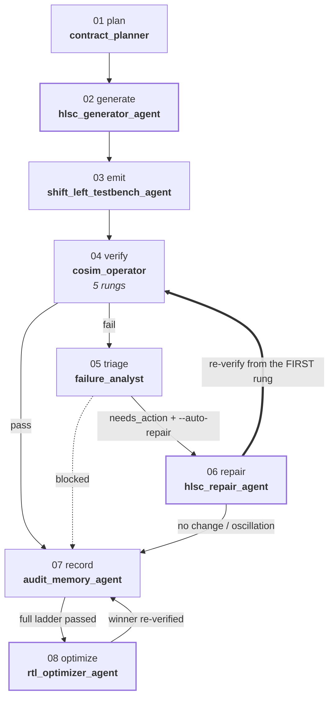
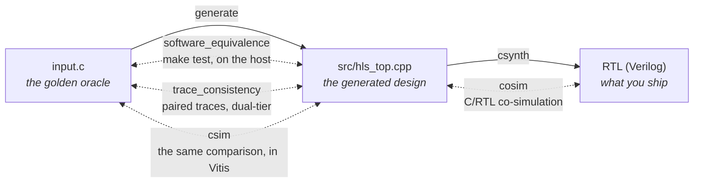
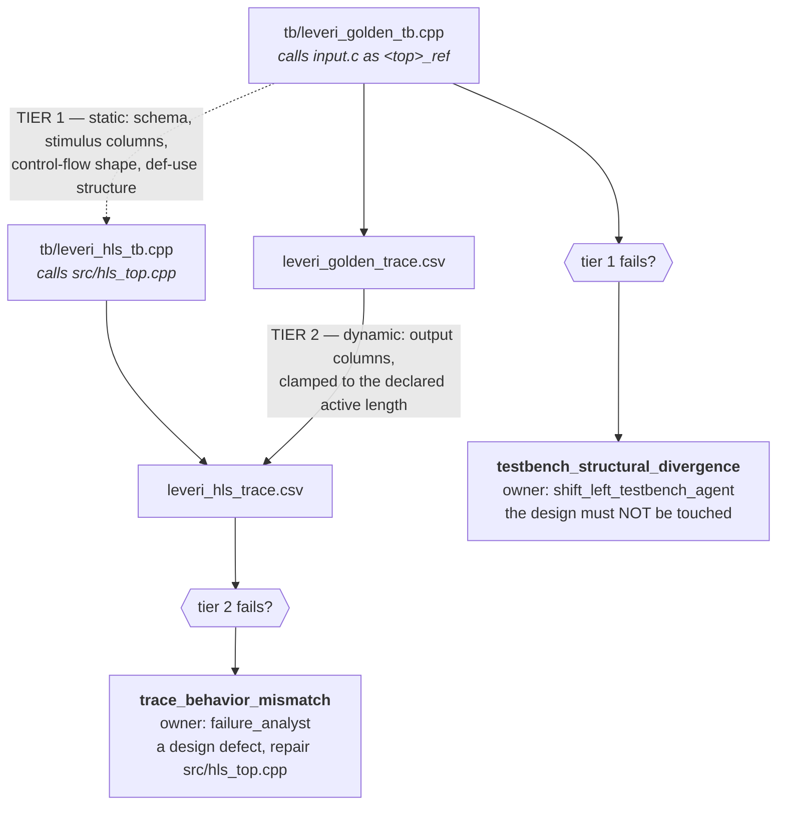
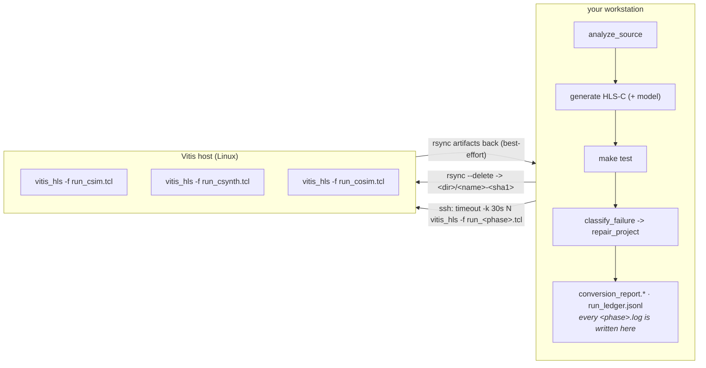
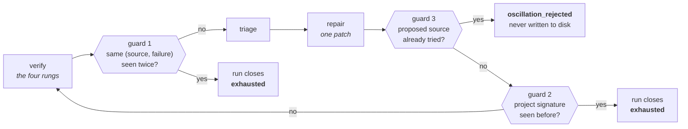
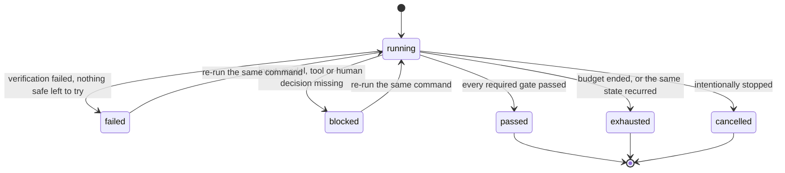
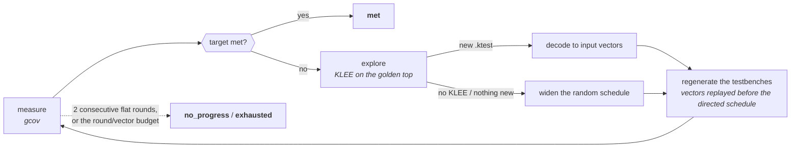
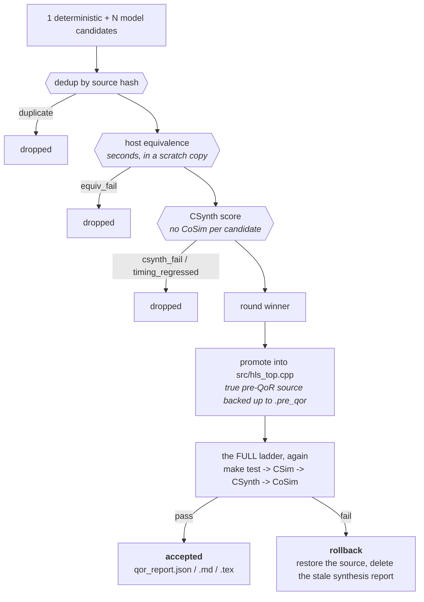

# The agent, end to end

How `c2hlsc_agent` gets from an input (a C file, a natural-language spec, or both) to a
Vitis HLS project whose RTL has been checked against the original C — every component,
every gate, every artifact, in the order they happen.

Companion documents:

- [`agent_components.md`](agent_components.md) — the generated per-component reference
  (contracts, entry points, artifacts, budgets, invariants, LLM seams).
- [`functional_equivalent_rtl_agent.md`](functional_equivalent_rtl_agent.md) — the design
  blueprint the components implement.
- [`continuous_agent_loop.md`](continuous_agent_loop.md) — the outer GitHub coordination
  loop and the bounded-run controller in team terms.

Inspect the scaffold live:

```text
python -m c2hlsc_agent components              # stage graph + every component
python -m c2hlsc_agent components --pipeline   # the default start-to-finish order
python -m c2hlsc_agent components --component hlsc_repair_agent
python -m c2hlsc_agent components --json
```

---

## 1. What "done" means

```text
original C + synchronized stimuli
  == host-equivalent HLS-C          (make test: golden C vs generated HLS-C, same stimuli)
  == Vitis CSim equivalent HLS-C    (same testbench, Vitis' own C simulation)
  == synthesized RTL                (CSynth produces Verilog/VHDL)
  == C/RTL CoSim passing            (generated HLS-C vs generated RTL)
```

This is bounded, testbench-driven functional equivalence under a declared interface
contract. It is much stronger than "Vitis produced Verilog" and weaker than a formal proof
over all inputs. Two invariants make the whole thing meaningful:

1. **The verifier is the only acceptance oracle.** Model output is a proposal. Nothing is
   accepted because a model said it was correct.
2. **The original C is the golden reference and is never handed to the model as an
   implementation to copy.** It is compiled into the testbench as a macro-renamed oracle
   (`<top>_ref`), and no component may rewrite it.

Everything below exists to keep those two statements true.

---

## 2. The eight components and the eight stages



The dashed edge is the one that is easy to miss: when triage returns `blocked` — no Vitis
on the machine, a broken SSH sync — the run reports and stops instead of "repairing"
source that was never the problem. The bold edge always re-enters at the **first** rung,
never at the phase that failed. The three bold-outlined components (`generate`, `repair`,
`optimize`) are the only ones a model can touch.

| Stage | Component | Status | What it decides |
| --- | --- | --- | --- |
| `plan` | `contract_planner` | deterministic | The must-preserve contract; can reject the input outright |
| `generate` | `hlsc_generator_agent` | llm_optional | Which candidate translation unit goes forward |
| `emit` | `shift_left_testbench_agent` | deterministic | The project on disk: sources, four testbench tiers, TCLs, Makefile |
| `verify` | `cosim_operator` | deterministic | Pass or fail — the only acceptance verdict |
| `triage` | `failure_analyst` | deterministic | Failure family, owning agent, evidence, allowed repair scope |
| `repair` | `hlsc_repair_agent` | llm_optional | One minimal, audited patch per iteration |
| `record` | `audit_memory_agent` | deterministic | The reports and the evidence chain |
| `optimize` | `rtl_optimizer_agent` | llm_optional | PPA, only after equivalence is signed off |

`deterministic` means no model is involved at all. `llm_optional` means a model may
propose and the deterministic path is both the floor and the fallback.

---

## 3. Setup

```text
python -m pip install -e .
python -m unittest discover -s tests      # 100% offline; no SDK, key, or network
```

Optional extras:

| Capability | Requirement |
| --- | --- |
| Host equivalence (`make test`) | `g++` and `make` |
| Vitis CSim / CSynth / CoSim | a licensed Vitis HLS install on `PATH`, or `--vitis-ssh` to a host that has one |
| YAML configs with anchors etc. | `PyYAML` (a dependency-free indent parser is used otherwise) |
| Model generation/repair | `claude` CLI on `PATH` (subscription auth, no key), or `ANTHROPIC_API_KEY`, or any OpenAI-compatible endpoint via `--llm-base-url` |
| gcov / KLEE coverage | `gcov`; `klee` + `clang++` |
| Local PPA (`optimize --local-ppa`) | `yosys`, OpenSTA (`sta`), a `.lib` liberty file |

The deterministic, offline path must keep working without any of the optional pieces — CI
deliberately exercises it.

---

## 4. The four commands

| Command | Purpose | Exit 0 when |
| --- | --- | --- |
| `convert` | The full pipeline: analyse → generate → emit → verify → (triage → repair → re-verify)\* → report | the required phases all passed |
| `repair` | Apply one repair from evidence produced by an *external* run (e.g. a Vitis machine) | a change was applied |
| `optimize` | Post-equivalence PPA loop on an already-verified project | no rollback, targets met (if any), and at least one candidate was actually scored |
| `status` | Read the persistent bounded-run ledger without touching it | a run record exists |
| `refine` | Coverage-driven stimulus refinement on a generated project | the target was met, or no target was set and the tooling ran |
| `doctor` | Check every external tool each tier needs, and install the missing ones | no *core* tool is missing |
| `components` | Inspect the component scaffold; runs nothing | always |

---

## 5. `convert`, step by step

The production driver is `cli.run_convert`. This is exactly what it does.

### 5.1 Resolve the configuration

`load_config(--config)` then `merge_cli_config(config, args)`. CLI flags win over the file.
Three resolution rules matter:

- `--use-llm` / `--no-llm` and `--run-vitis` / `--no-run-vitis` are *explicit-only*
  overrides; absent flags leave the config value alone.
- `--vitis-ssh` (or `C2HLSC_VITIS_SSH`) implies `--run-vitis` unless `--no-run-vitis` was
  passed explicitly.
- `--spec`/`--spec-file` and `--candidates N > 1` only mean anything on the model path, so
  they auto-enable it — unless `--no-llm` was explicit, in which case the agent says so on
  stderr and stays deterministic.

Defaults worth knowing: `num_tests=100`, `seed=1`, `part=xczu7ev-ffvc1156-2-e`,
`clock=10.0 ns`, `interface_mode=default` (no interface pragmas), `max_iterations=1`,
`auto_repair=False`, `run_vitis=False`, `use_llm=False`, `llm_candidates=1`.

**Three entry modes:**

| Mode | Trigger | What happens |
| --- | --- | --- |
| C input | `--input file.c` | The file is the golden oracle |
| C + intent | `--input file.c --spec "..."` | Same oracle; the spec is added to the generator prompt |
| NL-only | `--spec`/`--spec-file` with no `--input` | The model first writes `nl_reference.c` from the spec; **that** becomes the golden oracle and the rest of the pipeline is unchanged |

NL-only is inherently model-driven, so it forces `use_llm=True` and fails fast with a
`blocked` run if no backend is reachable. It also warns loudly when the generated
reference has unbounded array parameters — the testbench would have to guess a length
(16), which makes the equivalence claim unsound. Fix that with fixed-size arrays in the
spec or `arguments.<name>.length` in a config.

### 5.2 Start the bounded run controller

`_run_identity(config)` fingerprints everything that defines the run: a SHA-256 of the
input file contents, the NL spec, top, part, clock, seed, `run_vitis`, per-argument
metadata, compiler flags, test counts, interface mode, cosim tool, RTL language, and the
model backend/model/candidate count. `derive_run_id` hashes that into `run-<16 hex>`
unless `--run-id` overrides it, and `--new-run` suffixes a timestamp + random tag.

`RunController` then opens `PROJECT/run_ledger.jsonl` (git-ignored: it is machine state,
not source) and either starts a new record or resumes the existing one. Resuming is
refused when:

- the run id belongs to **different inputs** (identity fingerprint mismatch), or
- the **budgets differ** — budgets are immutable for the life of a run id, or
- the run is already `passed`, `exhausted`, or `cancelled`.

Budgets: `max_attempts = max(1, max_iterations)`, `max_wall_seconds` (default 14 400),
`max_llm_calls` (8), `max_vitis_runs` (8). Every ledger event is a **complete atomic JSON
snapshot** — written to a temp file, `fsync`ed, then `os.replace`d — so a killed process
can never leave a half-written event. Prompts, responses, API keys, and endpoints are
never written to it.

### 5.3 Build the model client (or don't)

`build_llm_client(config)` resolves a backend without ever touching the network at
construction time. `--llm-backend auto` picks, in order: an explicit `--llm-base-url`
(OpenAI-compatible) → the `claude` CLI if it is on `PATH` → the Anthropic SDK if it is
installed *and* a key is present → an OpenAI key → `none`.

The client is then wrapped in `BudgetedLLMClient`, which reserves one `llm_calls` unit
before each call and logs `llm_call_reserved` / `llm_call_completed` / `llm_call_failed`
to the ledger — counting calls without storing their content.

If `--use-llm` was asked for but nothing is reachable, `missing_llm_reason(config)` prints
the concrete reason and the run continues deterministically (except NL-only, which cannot).

### 5.4 `contract_planner` — analyse the source

`analyze_source(input, top, config)` does regex-based static analysis:

- locates the top function and extracts its return type, parameters, signature, and body
  (comment-stripped, string-aware brace matching);
- parses each parameter into a `FunctionArg` — pointer depth, array dims, constness — and
  strips C99 `restrict`/`__restrict__` so the generated C++ compiles;
- infers pointer **direction** from write (`=` not `==`) and read patterns → `input`,
  `output`, or `inout`, with config metadata always winning;
- applies configured `length`, `range`, and `interface` metadata per argument;
- emits **error** diagnostics for constructs that cannot be synthesized: `malloc`/`free`,
  `rand`/`qsort`, system calls, file or console I/O, function pointers, unbounded loops,
  recursion, unrestricted pointer arithmetic, variable-length arrays;
- defaults a missing pointer bound to **length 16 with a warning** — the single most
  common source of an unsound equivalence claim, so it is always visible in the report.

**Gate:** if any diagnostic is error-severity and `--keep-going` was not passed, the run
finishes as `blocked`, writes the report, and exits 1 *without* generating anything.

### 5.5 `hlsc_generator_agent` — propose the HLS-C

The conservative deterministic source is **always built first**: the original body copied
verbatim into `<top>(...)` with a generated header and, when `interface_mode` is not
`default`, the configured `#pragma HLS INTERFACE` lines. It is the baseline and the
fallback for every failure below.

With the model path enabled:

- **`--candidates 1` (default):** one generation attempt. The prompt carries the analysis
  (arguments, directions, bounds, diagnostics), the NL spec if present, and hard
  requirements — exact signature, one self-contained ```cpp translation unit, only
  equivalence-preserving pragmas. `extract_hls_source` then picks the last non-echo C/C++
  block that defines the top (preferring one after the policy's "annotated code" marker),
  checks it with `is_plausible_translation_unit` (balanced braces, defines the top), and
  prepends the header include if missing. Anything short of that → conservative copy, with
  the concrete failure recorded in the transformation ledger rather than swallowed.
- **`--candidates N > 1` (best-of-N):** `select_best_candidate` generates up to N
  structurally distinct candidates, writes each into `PROJECT/.candidates/cand_<k>`, and
  scores it with **local host equivalence only** (`make test`, seconds). The first
  zero-mismatch candidate wins immediately. Otherwise the winner is the one that stayed
  correct through the most tests (`first_failure_index`), and the repair loop takes it from
  there. Scores land in `candidate_scores.json`. Vitis only ever sees the winner.

If the `llm_calls` budget runs out mid-generation, generation falls back to deterministic
rather than killing the run — `llm_calls` is the one budget whose exhaustion is survivable.

### 5.6 `shift_left_testbench_agent` — emit the project

`write_project` materializes 21 files. This is where the testbench agent's outputs land,
alongside the generator's sources:

| Path | What it is |
| --- | --- |
| `input.c` | A copy of the golden oracle. **Never modified by any component.** |
| `src/hls_top.hpp` / `src/hls_top.cpp` | The generated design |
| `tb/testbench.cpp` | **The oracle harness.** Includes `../input.c` inside `extern "C"` with the top macro-renamed to `<top>_ref`, drives golden and HLS sides with identical seeded stimuli, compares with a relative float tolerance (1e-6), and prints mismatches in the exact format `parse_mismatches` reads |
| `tb/leveri_golden_tb.cpp`, `tb/leveri_hls_tb.cpp`, `tb/leveri_compare.py`, `tb/leveri_manifest.json`, `tb/stimulus_contract.json` | HLS-LeVeri paired-trace tier: both sides write per-cycle CSV traces; the comparator does a static check (header, roles, cycle count, identical stimulus columns) and a dynamic output check |
| `tb/run_gcov.py`, `tb/klee_driver.cpp`, `tb/run_klee.py` | Coverage hooks; both skip gracefully when the tools are absent |
| `tb/rtl_vectors_tb.cpp`, `tb/gen_rtl_tb.py`, `tb/run_rtl_sim.py`, `tb/rtl_tb_manifest.json` | Standalone RTL tier: golden vectors from the original C, a self-checking SystemVerilog testbench reconciled against the synthesized RTL's real ports, and a simulator runner |
| `run_hls.tcl` | The whole ladder in one script |
| `run_csim.tcl`, `run_csynth.tcl`, `run_cosim.tcl` | Per-phase scripts — what the verifier actually calls, so each phase gets its own timeout and its own log |
| `Makefile` | `test`, `leveri-test`, `gcov-coverage`, `klee-coverage`, `coverage`, `rtl-vectors`, `rtl-testbench`, `rtl-cosim`, `vitis`, `clean` |
| `run_all.sh` | `make test`, then Vitis if it is present |

Stimulus is deterministic: `mt19937_64(seed)` plus the directed patterns (`zeros`, `ones`,
`minmax`, `alternating`). Every reported mismatch carries its seed, so it reproduces.

### 5.7 The bounded verification loop

For each iteration up to `max_iterations`:

1. **Reserve budget.** `reserve_attempt(source_signature)` and, when `--run-vitis` is on,
   `reserve_vitis_run()`. A denial closes the run as `exhausted` and breaks out.
2. **`cosim_operator` verifies** (§6).
3. **Pass?** Record the verification, finish the run `passed`, break.
4. **Fail?** `failure_fingerprint(state)` normalizes the failing phases' evidence —
   timestamps, hex addresses, and absolute paths are replaced with placeholders, whitespace
   collapsed, last 4 000 characters kept — so "the same failure" is recognizable across
   machines and runs. `record_verification` returns how many times this exact
   *(source, failure)* pair has been seen; **more than once closes the run `exhausted`**.
5. **No `--auto-repair`?** Finish `failed` and stop. The evidence is on disk for the
   `repair` command.
6. **Attempt budget spent?** Finish `exhausted`.
7. **`hlsc_repair_agent` patches** (§8). No change → finish `failed`. A change that
   reproduces a previously seen `_project_signature` (SHA-256 over `src/hls_top.cpp` +
   `hls_top.hpp`) → finish `exhausted`.
8. Loop back to 1 — always re-verifying **from `software_equivalence`**, never resuming at
   the phase that failed.

Three independent oscillation guards therefore exist: the same *(source, failure)* pair
(controller), the same project signature (loop), and the same proposed source hash inside
the model repair itself.

### 5.8 `audit_memory_agent` — write the reports

`write_reports` always runs, including on failure, and writes:

- **`conversion_report.md`** — status, inputs, generated files, type mapping, argument
  directions, interface pragmas, the transformation ledger, unsupported constructs,
  diagnostics, coverage summary, per-phase results, the `failure_analyst` verdict, the
  repair audit table, parsed mismatches, and the bounded-run block.
- **`conversion_report.json`** — the same content, machine-readable, with a `run_control`
  object kept **separate** from the verification `status`. A `failed`, `blocked`, or
  `exhausted` run is never described as a successful conversion.

### 5.9 Exit code

`0` if and only if `final_status(...) == "pass"`: no error diagnostics, `software_equivalence`
passed, and — when `--run-vitis` was requested — `csim`, `csynth`, and `cosim` all passed.

---

## 6. The verification ladder in detail

`verify_project` runs `PHASE_ORDER = (software_equivalence, trace_consistency, csim, csynth, cosim)` and
short-circuits: the first non-pass phase marks every later phase `blocked`. Statuses are
used exactly: `pass`, `fail`, `blocked` (an earlier phase failed), `skipped` (never
requested). **A skipped or unrequested phase is never promoted to `pass`.**

| Phase | Command | Timeout | What it proves |
| --- | --- | --- | --- |
| `software_equivalence` | `tb/host_build.py test` | 120 s | Original C and generated HLS-C agree on the generated stimuli, on the host |
| `trace_consistency` | `tb/host_build.py leveri-test` | 180 s | The paired golden/HLS harnesses are structurally aligned (schema, stimulus, CFG, def-use) **and** their output traces agree — the shift-left dual tier |
| `csim` | `vitis_hls -f run_csim.tcl` | 600 s | The same comparison inside Vitis' own C simulation |
| `csynth` | `vitis_hls -f run_csynth.tcl` | 1200 s | The design synthesizes; produces the QoR report |
| `cosim` | `vitis_hls -f run_cosim.tcl` | 600 s | Generated HLS-C and the generated RTL agree |



**No single rung proves that the RTL matches the original C.** The host rungs compare
`input.c` against `src/hls_top.cpp`. CSynth compares nothing — it *produces* the RTL.
CoSim compares `src/hls_top.cpp` against that RTL. Only the unbroken chain gets you the
claim, which is why an earlier failure blocks every later rung instead of being skipped.

### The shift-left tier, in two tiers

`trace_consistency` implements the dual-tier check from the HLS-LeVeri shift-left work.
Both halves matter, and they answer *different* questions:



The static tier compares the two **harnesses**, not the two designs. Because both come
from one template it passes by construction today — which is the point: the day one side's
stimulus is augmented and the other's is not, the run reports a *harness* defect instead of
blaming the design. That separation is exactly what `classify_failure` routes on.

The dynamic tier clamps each output element to the array's declared active length (the
bounded scalar named `n`, `len`, `count`, …), the same way the oracle testbench's
`clamp_count` does. Without that, a design that legitimately leaves the tail of a buffer
untouched would be reported as a behavioural mismatch.

Notes that matter:

- **Process hygiene.** Every command runs in its own session; a timeout escalates
  `SIGTERM` on the process group → 10 s grace → `SIGKILL`, and the partial log is written
  to `<phase>.log` *before* the timeout propagates, so triage still gets evidence.
- **The CoSim log gate.** Vitis can exit 0 while the log reports a co-simulation failure.
  `_gate_cosim_on_log` reads stdout, stderr, and the log file, and downgrades `pass` to
  `fail` on an explicit failure marker. A zero exit code cannot defeat the equivalence gate.
- **Missing toolchain.** No `vitis_hls` on `PATH` fails `csim` with a message the
  classifier maps to `toolchain_unavailable` → `blocked`. The repair loop therefore does
  **not** mutate correct source over a missing tool.
- **The evidence chain is not interchangeable.** Host equivalence compares original C with
  generated HLS-C. CoSim compares generated HLS-C with generated RTL. The standalone RTL
  tier exercises synthesized RTL under its own interface contract. None of these may be
  substituted for another when reporting.

### Remote Vitis

`--vitis-ssh user@host` (or `C2HLSC_VITIS_SSH`) keeps analysis, generation, host
equivalence, and repair local and runs only the Vitis phases remotely:

1. `rsync` the project to `<remote-dir>/<project-name>-<sha1 of the absolute local path>`.
   The hash suffix stops two projects with the same basename — or two concurrent runs —
   from colliding under `--delete`.
2. Run `timeout -k 30s <n>s vitis_hls -f run_<phase>.tcl` over SSH. Without `--vitis-setup`
   the wrapper probes common `settings64.sh` locations and, on a miss, emits the exact
   `vitis_hls not found` marker so the local classifier still reports `toolchain_unavailable`.
3. `rsync` artifacts back (best-effort; the phase logs are already local, since the SSH
   console output is what gets written to `<phase>.log` — which is also what the CoSim log
   gate reads).



The logs stay local: each phase's `<phase>.log` is the SSH console output, written on your
side — which is exactly what the CoSim log gate reads, so the "exit 0 but the log says
fail" check works identically over SSH.

A **sync failure is infrastructure, not a code defect**: it is reported as
`remote vitis unavailable`, classified `blocked`, and no repair is attempted.

---

## 7. `failure_analyst` — the routing table

`classify_log_family(phase, text)` triages the failing phase's text, in this order:
`toolchain_unavailable` → `timeout_or_deadlock` → `behavioral_mismatch` →
`interface_contract` → `memory_pointer` → `numeric_bitwidth` → `loop_scheduling` →
`non_synthesizable_construct` → a per-phase default.

`classify_failure` turns that into an owner and a next action:

| Situation | Family | Owner | Status |
| --- | --- | --- | --- |
| Error diagnostics from analysis | `static_source_rejected` | `contract_planner` | needs_action |
| Host equivalence mismatch | `host_behavior_mismatch` | `failure_analyst` | needs_action |
| Host equivalence broken otherwise (compile, metadata) | triaged family | `shift_left_testbench_agent` | needs_action |
| Host equivalence never ran | `host_equivalence_not_run` | `cosim_operator` | needs_action |
| Host pass, Vitis not requested | `vitis_not_requested` | `cosim_operator` | **blocked** |
| Vitis missing / remote unreachable | `toolchain_unavailable` | `cosim_operator` | **blocked** |
| CoSim mismatch, failure, or hang | `rtl_cosim_mismatch` / `cosim_failure` / `timeout_or_deadlock` | `failure_analyst` (PMLC) | needs_action |
| CSynth failure | triaged family | `hlsc_repair_agent` | needs_action |
| Any other Vitis failure | triaged family | `hlsc_repair_agent` | needs_action |
| Everything passed | `functional_equivalence_signed_off` | `rtl_optimizer_agent` | **pass** |

Each verdict also carries `evidence_needed` (what the repair must be shown) and
`repair_scope` (what it may touch). Full logs stay audit-only; only compact excerpts ever
reach a prompt.

The `blocked` statuses are the important ones: they stop the loop from "repairing" source
that was never the problem.

---

## 8. `hlsc_repair_agent` — one minimal audited patch

Order of attempts, first match wins:

1. **Missing standard includes.** Undeclared-symbol errors are mapped to the header that
   declares them (`stddef.h`, `limits.h`, `string.h`, `math.h`, `ap_int.h`) and inserted
   into `src/hls_top.hpp` after the last existing include.
2. **C99 `restrict` for C++.** `restrict` → `__restrict__` across the sources, plus a
   testbench guard macro.
3. **Missing original support.** If the failing symbols are helper functions the original C
   defines, a guarded `#include "../input.c"` with the top renamed is injected — so a
   preserved top body can call the helpers it was written against.
4. **Invalid interface pragmas.** After an interface-family Vitis failure, the generated
   `#pragma HLS INTERFACE` lines are stripped and replaced with an explanatory comment.
5. **Model repair** — only if none of the above applied *and* the model path is enabled.
   The prompt carries the failure analysis, the truncated evidence, and the current file.
   The response must pass `extract_full_file` + `is_plausible_translation_unit`, and its
   hash is checked against **every source state already visited** (before/after hashes from
   the whole audit); a repeat is rejected as `oscillation_rejected` rather than written.



Guard 1 catches a repair that changed the code but not the outcome. Guard 2 catches a
repair that returned the project to a state it already occupied. Guard 3 catches a model
re-proposing a patch that was already tried — before it reaches disk, so it costs nothing.

Hard boundaries: **only `src/hls_top.cpp` is model-writable.** `input.c` and every `tb/`
file are off limits, so a model can never "fix" a failure by weakening the oracle.

Every change appends to `repair_audit.json`: iteration, stage, family, owner, status,
summary, target files, before/after SHA-256, a unified diff, the evidence excerpt, the next
action, and the allowed repair scope. Statuses are `pass`, `blocked`, `applied`,
`applied_llm`, `oscillation_rejected`, `no_change`.

### `repair` — the split-machine flow

When Vitis lives on another machine and you do not want SSH in the loop, run the ladder
there and bring the evidence back:

```text
# on the Vitis machine
vitis_hls -f run_csynth.tcl 2>&1 | tee csynth.log

# on the workstation
python -m c2hlsc_agent repair \
  --project c2hlsc_project \
  --stage csynth \
  --evidence csynth.log \
  --use-llm
```

`_external_failure_state` synthesizes a `VerificationState` from that: phases before the
declared stage are assumed passed, the declared stage failed with your evidence, later
phases are blocked — and the declared stage is force-appended if it is not in the plan, so
an operator-declared failure is never silently dropped. The result is
`manual_repair_report.json`; exit 0 means a change was applied. **Re-run verification from
the beginning afterwards.**

---

## 9. Bounded run control

| Status | Meaning | What to do |
| --- | --- | --- |
| `running` | Active, or interrupted mid-session | The owner continues; nobody else duplicates it |
| `passed` | Every required gate passed | Ship it |
| `failed` | Verification failed and no safe automatic step remains | Add evidence and a concrete next action |
| `blocked` | A required input, model, tool, or human decision is missing | Name the blocker and its owner |
| `exhausted` | A budget ended or the same state recurred | Stop automation; review before `--new-run` |
| `cancelled` | Intentionally stopped | Record why |



`failed` and `blocked` resume with their counters intact. `passed`, `exhausted`, and
`cancelled` are **closed**: resuming is refused, and a reset needs `--new-run`. Budgets are
immutable for the life of a run id — that is the point of them.

```text
python -m c2hlsc_agent status --project c2hlsc_project
python -m c2hlsc_agent status --project c2hlsc_project --json
```

Re-running the same `convert` command **resumes** a `failed` or `blocked` run with its
counters intact. Budgets cannot be raised mid-run — that is the point. `--new-run` is for
an intentional reset only: changed requirements, corrected input, an approved budget change.

---

## 10. Stimulus, coverage, and the refinement loop

### The directed schedule is configuration, not a constant

`directed_tests` orders the leading directed cases; every later test is pseudo-random from
the seeded `mt19937_64` stream. Slot *i* of the run uses pattern *i*:

| Pattern | What every element gets |
| --- | --- |
| `zeros` | `0` |
| `ones` | all bits set |
| `minmax` | type max, alternating with type min for signed types (integers only) |
| `alternating` | `0xAAAAAAAA` / `0x55555555` by element index |
| `random` | an explicit "leave this slot pseudo-random" marker |

Bounded scalars get their own corner schedule over the same slots — low, high, midpoint,
one — capped at the length of `directed_tests`, so `directed_tests: []` really does mean
*no directed cases anywhere*. An unrecognized name is rejected at generation time rather
than silently ignored, and the report prints the schedule that was actually compiled in.

### Measuring coverage

```text
make gcov-coverage    # line and branch coverage, PARSED into a number
make klee-coverage    # symbolic exploration of the golden top
make refine-coverage  # the loop below
```

`run_gcov.py` compiles each translation unit separately (a one-step multi-source build
makes gcc name the notes files in a way gcov cannot resolve, which silently drops
`src/hls_top.cpp` out of the number), runs both trace testbenches, runs the dual-tier
comparison, then parses every `.gcov` file into:

- `line_coverage` / `branch_coverage`, measured over `input.c` and `src/hls_top.cpp` only —
  the harness is 100% covered by construction and would mask the real figure;
- `uncovered_lines` and `uncovered_branches`, with file and line, which is what the
  refinement loop steers toward.

Set `C2HLSC_MIN_COVERAGE=95` to turn coverage into a gate. It compares against the
**weaker** of line and branch coverage: line coverage alone saturates easily while a whole
branch stays unreached, which is precisely the case worth catching.

### Refining the stimulus against what it missed



```text
c2hlsc-agent refine --project c2hlsc_project --target 95 --max-rounds 5
```

Each `.ktest` KLEE writes is a concrete input assignment for a path it reached. The loop
decodes it (big-endian header, little-endian object bytes, one element per argument width),
clamps scalars into their declared ranges, and folds it in as an `ExtraVector` — a
permanent directed case replayed *before* the schedule. A branch guarded by `x == 424242`
becomes a reproducible test instead of a coverage hole.

Where KLEE is unavailable — notably macOS, which has no native package — the loop falls
back to **widening** the random schedule and says so in the report. Widening cannot reach a
guarded equality branch; the report never implies otherwise.

Bounds: 5 rounds, 64 vectors, 4096 tests, and a stop after **two consecutive** rounds that
fail to move the number (one flat round is not proof, since widening is probabilistic).

Two invariants: refinement only ever **adds test cases** — it reads `src/hls_top.cpp` back
and writes it out unchanged, so a repaired or optimized design survives a round untouched —
and the added cases are real tests the design has not been checked against yet, so the
command tells you to re-run verification afterwards.

### Testbench tiers beyond the ladder

```text
make rtl-vectors      # golden expected vectors from the original C
make rtl-testbench    # render a self-checking SV testbench against the synthesized RTL ports
make rtl-cosim        # simulate the RTL against those vectors
```

The RTL tier is **not** Vitis CoSim. It exercises synthesized RTL under its own declared
interface contract, and its results must be reported as such.

### Running on native Windows

`make` is not a Windows tool, and both host rungs are required on every verification — so
`make` is not on the critical path at all. Every recipe lives in the generated
**`tb/host_build.py`**, which the agent invokes with its own `sys.executable`; the Makefile
is a thin alias over the same file, so `make test` still does what everyone expects and
there is still exactly one definition of each recipe.

What a native Windows box actually needs:

| Need | Answer |
| --- | --- |
| Compiler | A GCC/Clang-style driver: `winget install LLVM.LLVM`, or MSYS2 `mingw-w64-gcc`. **MSVC (`cl.exe`) is detected and reported, never silently used** — its flag syntax (`/std:c++17`, `/Fe`) is incompatible, and mistranslating flags would fail confusingly |
| Python | Any 3.10+; the agent passes its own interpreter through, so `python` vs `python3` never matters |
| make | **Not needed.** `doctor` marks it optional and will not fail a machine without it |
| A POSIX shell | **Not needed.** `run_all.py` is the shell-free sibling of `run_all.sh` |

Other Windows-specific behaviour: executables get a `.exe` suffix, a timed-out command is
killed with `taskkill /T` (there are no POSIX process groups, so without it a hung compiler
or simulator leaves orphaned children holding output files open), and `doctor` uses
`winget`, with every package id verified by `winget show` before it is offered.

Verified two ways: a full conversion here with `make`, `bash` and `sh` all absent from
`PATH` (both host rungs pass, exit 0), and a CI step on `windows-latest` that converts
`examples/vector_add` and asserts the report status. The test suite runs the same way —
guards ask for a *compiler*, not for `make`, so 278 of 284 tests execute on a machine
without it rather than skipping.

For a fresh Windows clone: `powershell -ExecutionPolicy Bypass -File scripts\setup_windows.ps1`
installs the package, checks the tools, and runs the suite.

### When a tool is missing

```text
c2hlsc-agent doctor                  # what is here, what is not, and what would install it
c2hlsc-agent doctor --install        # install the missing ones (Homebrew / apt / dnf / pacman)
c2hlsc-agent doctor --install --dry-run --tier ppa
```

Tools are grouped by the tier that stops working without them: `core` (g++, make, python3),
`coverage` (gcov), `symbolic` (klee, clang++), `ppa` (yosys, OpenSTA), `rtl` (iverilog,
verilator), `vendor` (vitis_hls). Three rules keep it honest:

- **Nothing installs on its own.** `doctor` only looks until you pass `--install`.
- **A package name is verified before it is offered.** Homebrew formulae are confirmed with
  `brew info` first, so you are never handed a command that does not exist.
- **Some tools cannot be installed this way and say so** — KLEE has no macOS formula (the
  official Docker image is the supported route), and Vitis HLS is a licensed vendor
  download that is Linux-only; from a Mac, run it remotely with `--vitis-ssh`.

`doctor` exits non-zero only when a **core** tool is missing; an absent optional tool is a
narrower flow, not a broken install.

---

## 11. `optimize` — post-equivalence PPA

Disabled until equivalence is signed off. Never its own oracle.

```text
python -m c2hlsc_agent optimize --project c2hlsc_project --objective latency --iterations 4
python -m c2hlsc_agent optimize --project c2hlsc_project \
  --target-latency 128 --target-slack 0.5 --target-area 5000 --max-rounds 5 --local-ppa
```

1. **Baseline.** Reuse the project's `csynth.xml` only if it is *fresh* (newer than the
   sources it describes) and parseable; otherwise synthesize once. With PPA targets or
   `--local-ppa`, also run the local yosys → gate-level sim → OpenSTA step for area, slack,
   and power. If the baseline already meets every target, stop and say so.
2. **Propose.** Round 0 adds one deterministic candidate (pipeline the innermost loops).
   Then N model candidates per round, prompted with the current metrics, the remaining
   target gaps, and the history of what has already been tried.
3. **Gate every candidate**, in this order — each step is cheap relative to the next:
   duplicate-hash rejection → staged scratch copy in `.qor/cand_<i>` → **local host
   equivalence** → **CSynth only** (`run_vitis(..., upto="csynth")`, no CoSim per
   candidate) → objective score (`latency`, `area`, or `balanced` = latency×area relative
   to baseline) → optional local PPA. A candidate that breaks timing when the baseline met
   it is marked `timing_regressed` and cannot win.
4. **Rounds.** Without targets, one round and the best improver wins. With targets, each
   round's winner becomes the new working point and the next round's prompt carries the
   remaining gaps, until every target is met, no candidate improves, or `--max-rounds` is
   spent.
5. **Promote and re-verify.** The winner is written into `src/hls_top.cpp` after backing up
   the true pre-QoR source to `src/hls_top.cpp.pre_qor` (never overwritten on repeat runs),
   then the **full ladder** runs again. `--no-cosim-winner` weakens this to host equivalence
   only and is not recommended.
6. **Rollback on failure.** The original source is restored **and** the rejected
   candidate's stale synthesis report is deleted, so the next run re-establishes a true
   baseline. The candidate is recorded as `final_ladder_fail`.
7. **Report.** `qor_report.json`, `qor_report.md`, and `qor_table.tex` (LaTeX, for papers).
   Losing candidate directories are deleted; the winner's is kept for provenance.



Cheap filters run first: only candidates that already pass host equivalence pay for
synthesis, and no candidate pays for CoSim. CoSim is spent once, on the winner, as the
acceptance test.

Exit code 1 means: rolled back, or explicit targets were not met, or **no candidate was
ever scored** — the last case is an infrastructure problem (usually no Vitis) and is
reported as such rather than as a QoR verdict. Never quote latency, area, timing, or power
without a fresh report and a named tool, version, part, and clock.

---

## 12. Artifact map

| File | Written by | Read by |
| --- | --- | --- |
| `input.c` | `shift_left_testbench_agent` (copy) | every testbench; never modified |
| `src/hls_top.{hpp,cpp}` | generator, then repair, then optimizer | ladder, candidates |
| `tb/*` | `shift_left_testbench_agent` | ladder + the optional tiers |
| `tb/host_build.py` | `shift_left_testbench_agent` | the agent, and every Makefile recipe |
| `run_{hls,csim,csynth,cosim}.tcl`, `Makefile`, `run_all.sh`, `run_all.py` | `shift_left_testbench_agent` | `cosim_operator` |
| `software_equivalence.log`, `trace_consistency.log`, `csim.log`, `csynth.log`, `cosim.log` | `cosim_operator` | `failure_analyst`, repair evidence |
| `leveri_golden_trace.csv`, `leveri_hls_trace.csv` | the paired trace testbenches | `tb/leveri_compare.py` (dual tier) |
| `coverage/gcov_report.json`, `coverage/klee_report.json` | the coverage targets | `refine`, the conversion report |
| `coverage_refinement.json` | `refine` | humans; records every round and every added vector |
| `c2hlsc_project/` | Vitis | `qor.parse_csynth_xml`, the RTL tier |
| `candidate_scores.json`, `.candidates/` | best-of-N generation | the report |
| `repair_audit.json` | `hlsc_repair_agent` | the report, the oscillation guard, future retrieval memory |
| `run_ledger.jsonl` | `RunController` | `status`, resume, the report's `run_control` block |
| `conversion_report.{md,json}` | `audit_memory_agent` | humans, CI, `repair`/`optimize` defaults |
| `qor_report.{json,md}`, `qor_table.tex`, `.qor/`, `src/hls_top.cpp.pre_qor` | `rtl_optimizer_agent` | humans, papers |
| `manual_repair_report.json` | `repair` | humans |

---

## 13. Corpus tooling

Beyond a single conversion, `scripts/` operates on the HLS_NL dataset:

| Script | What it does |
| --- | --- |
| `cosim_repair_loop.py` | Closed-loop CSim→CSynth→CoSim with repair through the **local `claude` CLI by default** (subscription auth, no API key); `--claude-cmd "ssh you@mac claude"` drives a workstation from the Vitis server |
| `run_hls_nl_vitis_batch.py` | Batch Vitis over dataset records with per-phase timeouts, process-group-safe kills, and resume via a previous results file |
| `run_hls_nl_vitis_triage.sh` | The one-command fast sweep: CSim+CSynth, filter passes, split CoSim on the survivors, write an attention list |
| `generate_hls_nl_testbenches.py` | Testbench scaffolds; default `driver` mode is stimulus-only because **CoSim is the oracle**, with an opt-in heuristic `semantic` mode |
| `generate_hls_nl_llm.py` | Threaded batch NL→HLS-C generation across backends; output is drop-in input for the batch runner |
| `repair_hls_nl_dataset.py` | Auditable mechanical dataset repair (accept / quarantine / delete) with reports |
| `export_cosim_successes.py` | A clean corpus of CoSim-passing cases with evidence |
| `collect_debug_bundle.py` | A tarball of reports, logs, TCLs, and sources for handoff |

---

## 14. Making a component live

Each component is a thin adapter, so a live agent replaces one `run` body — never the
ladder. Recommended order, lowest risk first:

1. **`failure_analyst`.** Replace regex triage with a model that returns the same
   `FailureAnalysis` dataclass, and add PMLC slicing for CoSim mismatches (normalize the
   mismatch → slice backward from failed outputs → instrument suspect variables in both
   sides and align the first divergent value). Zero risk: the output shape is already
   validated and the verifier still decides.
2. **`contract_planner`.** A model pass proposing directions, bounds, and ranges where
   regex inference is uncertain, emitting the same `ArgumentConfig` shape — surfaced as
   config proposals rather than silent changes.
3. **`shift_left_testbench_agent`.** Model-proposed extra directed stimuli and
   coverage-driven refinement **on top of** the deterministic testbench. The deterministic
   harness stays the floor; nothing a model writes may weaken the oracle.
4. **`rtl_optimizer_agent`.** One optimization family per round (pipeline, unroll, array
   partition, dataflow, interface, bitwidth narrowing) with an explicit candidate queue and
   recorded rollbacks.
5. **`audit_memory_agent`.** Promote audited failure-to-pass chains from `repair_audit.json`
   into retrieval memory keyed by failing stage + failure family + named symbols. Reference
   HLS, hidden labels, and manual fixes must never enter prompt-facing memory.

`LLMClient.complete(system, user)` is single-shot by design. The Claude-CLI completer in
`scripts/cosim_repair_loop.make_completer` is the template for subscription-auth agents; a
richer multi-turn or tool-using loop is fine, as long as every agent keeps returning
**verifier-checkable artifacts**.

---

## 15. Things that must not break

- `extract_hls_source` / `is_plausible_translation_unit` — the structural gates on every
  model-produced translation unit.
- The deterministic fallback in `generate_hls_sources`, and the fact that every fallback
  reason is recorded rather than swallowed.
- The never-hand-the-original-C-to-the-model rule.
- `_gate_cosim_on_log` — exit code 0 is not a CoSim pass.
- Only `src/hls_top.cpp` is model-writable; `input.c` and `tb/` are not.
- The paired harnesses run one schedule, and the static tier *proves* that rather than
  assuming it. A static-tier failure is a harness defect and must never be repaired as a
  design defect.
- Refinement only adds test cases. It reads the design back and writes it out unchanged.
- Coverage is measured over the specification and the design, never the harness, and a
  coverage number is only ever reported from a parsed report.
- The three oscillation guards, and immutable budgets across resume.
- Repair and transformation audit provenance: no hidden failed phase, oscillation
  rejection, deterministic fallback, or unavailable backend.
- Status vocabulary: `pass`, `fail`, `blocked`, `skipped` used exactly as emitted, and
  `run_control` status never described as a verification result.

---

## 16. Worked examples

```text
# Deterministic, host equivalence only — no model, no Vitis, no network.
python -m c2hlsc_agent convert \
  --input examples/vector_add/input.c --top vector_add \
  --config examples/vector_add/config.yaml --out build/vector_add

# Full ladder locally, with bounded automatic repair through the Claude CLI.
python -m c2hlsc_agent convert \
  --input examples/simple_fir/input.c --top simple_fir \
  --config examples/simple_fir/config.yaml --out build/fir \
  --run-vitis --use-llm --llm-backend claude-cli \
  --auto-repair --max-iterations 4 --max-llm-calls 8 --max-vitis-runs 4

# Best-of-4 generation; only the local-equivalence winner reaches Vitis on a remote host.
python -m c2hlsc_agent convert \
  --input examples/bit_ops/input.c --top bit_ops --out build/bit_ops \
  --use-llm --candidates 4 --vitis-ssh user@vitis-host

# NL-only: the model writes the golden reference first, then the design.
python -m c2hlsc_agent convert \
  --spec "8-bit saturating adder; inputs a and b, output sum, saturate at 255" \
  --top sat_add --out build/sat_add --run-vitis

# Check the toolchain first; install whatever this machine is missing.
python -m c2hlsc_agent doctor
python -m c2hlsc_agent doctor --install

# Drive structural coverage up, then re-verify against the cases that were added.
python -m c2hlsc_agent refine --project build/fir --target 95 --verbose
python -m c2hlsc_agent convert --input examples/simple_fir/input.c --top simple_fir \
  --config examples/simple_fir/config.yaml --out build/fir --new-run

# Inspect, then optimize.
python -m c2hlsc_agent status --project build/fir
python -m c2hlsc_agent optimize --project build/fir --objective balanced --iterations 4
```
